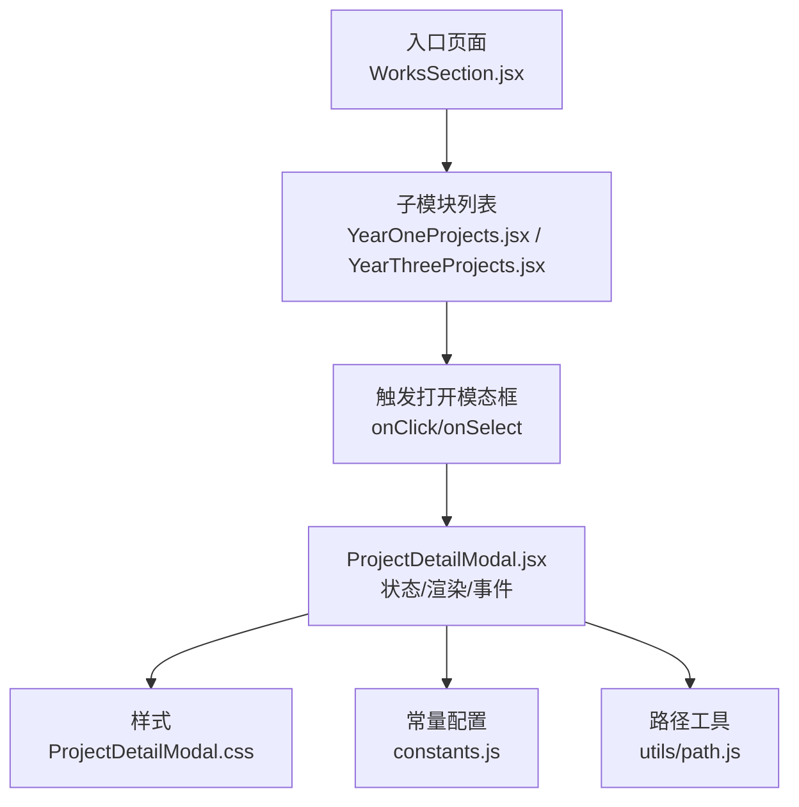
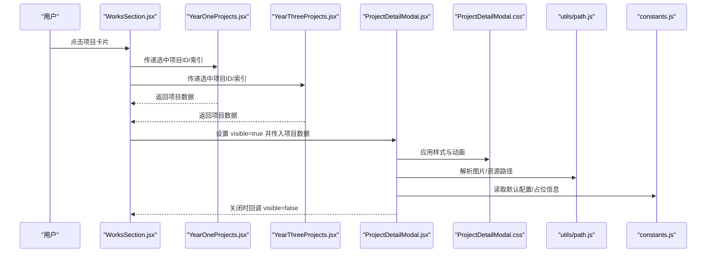
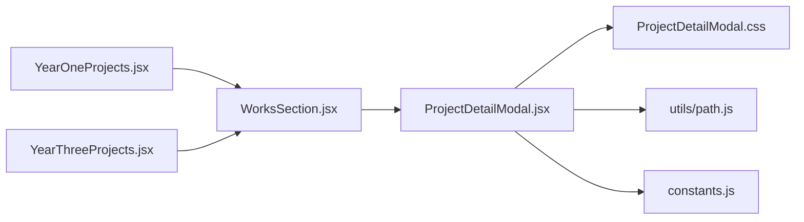

# 项目详情模态框

<cite>
**本文引用的文件**   
- [ProjectDetailModal.jsx](file://src/components/ProjectDetailModal.jsx)
- [ProjectDetailModal.css](file://src/components/ProjectDetailModal.css)
- [WorksSection.jsx](file://src/components/WorksSection.jsx)
- [YearOneProjects.jsx](file://src/components/YearOneProjects.jsx)
- [YearThreeProjects.jsx](file://src/components/YearThreeProjects.jsx)
- [constants.js](file://src/constants.js)
- [path.js](file://src/utils/path.js)
</cite>

## 目录
1. [简介](#简介)
2. [项目结构](#项目结构)
3. [核心组件](#核心组件)
4. [架构总览](#架构总览)
5. [详细组件分析](#详细组件分析)
6. [依赖关系分析](#依赖关系分析)
7. [性能考虑](#性能考虑)
8. [故障排查指南](#故障排查指南)
9. [结论](#结论)
10. [附录](#附录)

## 简介
本项目详情模态框用于在作品集页面中展示单个项目的详细内容，包括动态内容加载、富文本渲染与图片展示。该文档围绕 ProjectDetailModal 组件的交互设计、状态管理、内容渲染机制、打开关闭逻辑、键盘导航与无障碍访问、事件处理、生命周期管理与内存优化进行系统性说明，并提供集成与定制指南，帮助开发者快速上手并扩展功能。

## 项目结构
与项目详情模态框相关的代码主要位于 src/components 目录下，其中：
- ProjectDetailModal.jsx 为模态框主实现
- ProjectDetailModal.css 为样式定义
- WorksSection.jsx、YearOneProjects.jsx、YearThreeProjects.jsx 为触发入口或数据源
- constants.js 提供常量配置（如默认值、路由片段等）
- utils/path.js 提供路径解析工具，辅助资源定位

图表来源
- [WorksSection.jsx](file://src/components/WorksSection.jsx)
- [YearOneProjects.jsx](file://src/components/YearOneProjects.jsx)
- [YearThreeProjects.jsx](file://src/components/YearThreeProjects.jsx)
- [ProjectDetailModal.jsx](file://src/components/ProjectDetailModal.jsx)
- [ProjectDetailModal.css](file://src/components/ProjectDetailModal.css)
- [constants.js](file://src/constants.js)
- [path.js](file://src/utils/path.js)

章节来源
- [ProjectDetailModal.jsx](file://src/components/ProjectDetailModal.jsx)
- [ProjectDetailModal.css](file://src/components/ProjectDetailModal.css)
- [WorksSection.jsx](file://src/components/WorksSection.jsx)
- [YearOneProjects.jsx](file://src/components/YearOneProjects.jsx)
- [YearThreeProjects.jsx](file://src/components/YearThreeProjects.jsx)
- [constants.js](file://src/constants.js)
- [path.js](file://src/utils/path.js)

## 核心组件
- ProjectDetailModal 负责：
  - 接收项目数据与打开状态
  - 管理内部状态（是否可见、当前选中项、滚动位置、焦点管理等）
  - 处理打开/关闭逻辑与键盘导航（Esc 关闭、Tab 聚焦循环）
  - 渲染标题、描述、图片、富文本等内容
  - 通过 props 暴露回调以通知父组件状态变化
- 样式由 ProjectDetailModal.css 控制布局、动画与可访问性焦点样式
- 数据来源可能来自父组件（如 WorksSection）或本地常量（constants.js），并通过 path.js 解析资源路径

章节来源
- [ProjectDetailModal.jsx](file://src/components/ProjectDetailModal.jsx)
- [ProjectDetailModal.css](file://src/components/ProjectDetailModal.css)
- [constants.js](file://src/constants.js)
- [path.js](file://src/utils/path.js)

## 架构总览
从用户操作到内容展示的调用序列如下：

图表来源
- [WorksSection.jsx](file://src/components/WorksSection.jsx)
- [YearOneProjects.jsx](file://src/components/YearOneProjects.jsx)
- [YearThreeProjects.jsx](file://src/components/YearThreeProjects.jsx)
- [ProjectDetailModal.jsx](file://src/components/ProjectDetailModal.jsx)
- [ProjectDetailModal.css](file://src/components/ProjectDetailModal.css)
- [path.js](file://src/utils/path.js)
- [constants.js](file://src/constants.js)

## 详细组件分析

### 交互设计与打开关闭逻辑
- 打开方式：父组件根据用户点击或选择事件，将 selectedProject 与 visible 传递给模态框
- 关闭方式：
  - 点击遮罩层或关闭按钮
  - 按下 Esc 键
  - 外部点击（可选）
- 焦点管理：
  - 打开时将焦点移至模态框内首个可聚焦元素
  - 关闭后恢复焦点至触发元素
  - Tab 键在模态框内形成焦点环，避免焦点逃逸

章节来源
- [ProjectDetailModal.jsx](file://src/components/ProjectDetailModal.jsx)
- [ProjectDetailModal.css](file://src/components/ProjectDetailModal.css)

### 键盘导航与无障碍访问
- 键盘支持：
  - Esc 关闭
  - Tab/Shift+Tab 在模态框内循环聚焦
  - Enter/Space 激活按钮
- 无障碍属性：
  - role="dialog" 与 aria-modal="true"
  - aria-labelledby 指向标题节点
  - aria-describedby 指向描述节点
  - 焦点陷阱与初始焦点设置
  - 屏幕阅读器提示（如“已打开项目详情”）

章节来源
- [ProjectDetailModal.jsx](file://src/components/ProjectDetailModal.jsx)
- [ProjectDetailModal.css](file://src/components/ProjectDetailModal.css)

### 内容渲染机制
- 标题与描述：从项目数据中读取并渲染
- 图片展示：
  - 使用 path.js 解析相对路径或静态资源路径
  - 支持懒加载与占位图
  - 错误回退与重试策略
- 富文本渲染：
  - 若内容为结构化数据（如 Markdown/HTML），需安全转义与白名单过滤
  - 建议采用受控渲染方案，避免执行不可信脚本
- 动态加载：
  - 按需加载大图片或视频
  - 分页或虚拟滚动（当内容较多时）

章节来源
- [ProjectDetailModal.jsx](file://src/components/ProjectDetailModal.jsx)
- [path.js](file://src/utils/path.js)
- [constants.js](file://src/constants.js)

### 状态管理与生命周期
- 关键状态：
  - visible：控制显示/隐藏
  - projectData：当前项目数据
  - focusIndex：当前焦点元素索引
  - loading/error：加载状态与错误处理
- 生命周期：
  - 打开：初始化焦点、记录触发元素、开始加载资源
  - 更新：响应项目数据变更，重新计算路径与渲染
  - 关闭：清理定时器/监听器、释放资源、恢复焦点

章节来源
- [ProjectDetailModal.jsx](file://src/components/ProjectDetailModal.jsx)

### 事件处理机制
- 用户事件：
  - onClick（遮罩/关闭按钮）
  - onKeyDown（Esc/Tab/Enter/Space）
  - onScroll（懒加载与视口检测）
- 系统事件：
  - 窗口 resize 适配布局
  - 资源加载完成回调（onLoad/onError）
- 回调接口：
  - onClose(visible=false)
  - onProjectChange(projectId)

章节来源
- [ProjectDetailModal.jsx](file://src/components/ProjectDetailModal.jsx)

### 自定义样式与主题
- 通过 CSS 变量或类名覆盖默认样式
- 支持暗色模式切换与高对比度主题
- 响应式布局适配移动端与桌面端

章节来源
- [ProjectDetailModal.css](file://src/components/ProjectDetailModal.css)

### 扩展内容类型
- 新增媒体类型（视频、音频、PDF）：
  - 在渲染分支中增加类型判断
  - 引入对应播放器或预览组件
- 富文本增强：
  - 支持代码块高亮、表格、链接跳转
  - 添加评论或收藏功能（通过回调与外部状态管理）

章节来源
- [ProjectDetailModal.jsx](file://src/components/ProjectDetailModal.jsx)

## 依赖关系分析
- 组件耦合：
  - ProjectDetailModal 依赖父组件提供项目数据与可见性控制
  - 通过 path.js 解析资源路径，降低硬编码耦合
  - 使用 constants.js 集中管理默认值与配置
- 外部依赖：
  - 无重型第三方库依赖，便于替换与裁剪
  - 样式独立，便于主题化

图表来源
- [ProjectDetailModal.jsx](file://src/components/ProjectDetailModal.jsx)
- [ProjectDetailModal.css](file://src/components/ProjectDetailModal.css)
- [path.js](file://src/utils/path.js)
- [constants.js](file://src/constants.js)
- [WorksSection.jsx](file://src/components/WorksSection.jsx)
- [YearOneProjects.jsx](file://src/components/YearOneProjects.jsx)
- [YearThreeProjects.jsx](file://src/components/YearThreeProjects.jsx)

章节来源
- [ProjectDetailModal.jsx](file://src/components/ProjectDetailModal.jsx)
- [path.js](file://src/utils/path.js)
- [constants.js](file://src/constants.js)
- [WorksSection.jsx](file://src/components/WorksSection.jsx)
- [YearOneProjects.jsx](file://src/components/YearOneProjects.jsx)
- [YearThreeProjects.jsx](file://src/components/YearThreeProjects.jsx)

## 性能考虑
- 资源加载优化：
  - 图片懒加载与缩略图优先
  - 预取常用项目数据（基于用户行为预测）
- 渲染优化：
  - 仅渲染可见区域内容
  - 对富文本进行增量更新与缓存
- 内存管理：
  - 关闭时移除事件监听与定时器
  - 释放大型对象引用，避免内存泄漏

[本节为通用指导，不直接分析具体文件]

## 故障排查指南
- 常见问题：
  - 图片无法加载：检查路径解析逻辑与资源存在性
  - 键盘导航失效：确认焦点陷阱与 aria-* 属性是否正确设置
  - 模态框未关闭：验证 Esc 与点击遮罩事件绑定
  - 富文本渲染异常：确保内容安全过滤与格式正确
- 调试技巧：
  - 打印项目数据与路径解析结果
  - 使用浏览器开发者工具监控网络请求与资源加载
  - 启用无障碍审计工具验证可访问性

章节来源
- [ProjectDetailModal.jsx](file://src/components/ProjectDetailModal.jsx)
- [ProjectDetailModal.css](file://src/components/ProjectDetailModal.css)

## 结论
ProjectDetailModal 提供了完整的项目详情展示能力，涵盖交互、无障碍、内容与性能优化。通过清晰的 props 接口与可扩展的渲染机制，开发者可以快速集成并根据业务需求进行定制。遵循本文档的最佳实践与故障排查建议，可获得稳定且友好的用户体验。

[本节为总结性内容，不直接分析具体文件]

## 附录

### 集成步骤
- 在父组件中维护 visible 与 selectedProject 状态
- 将状态与回调传递给 ProjectDetailModal
- 根据项目数据结构填充标题、描述、图片与富文本
- 使用 path.js 统一解析资源路径
- 通过 constants.js 管理默认配置与占位信息

章节来源
- [ProjectDetailModal.jsx](file://src/components/ProjectDetailModal.jsx)
- [path.js](file://src/utils/path.js)
- [constants.js](file://src/constants.js)

### 配置示例（概念性）
- 项目数据字段：
  - id：唯一标识
  - title：标题
  - description：描述（可为富文本）
  - images：图片数组（含路径与替代文本）
  - meta：元数据（标签、日期等）
- 模态框配置：
  - visible：布尔值
  - onClose：回调函数
  - theme：主题名称
  - lazyLoad：是否启用懒加载

章节来源
- [ProjectDetailModal.jsx](file://src/components/ProjectDetailModal.jsx)
- [constants.js](file://src/constants.js)