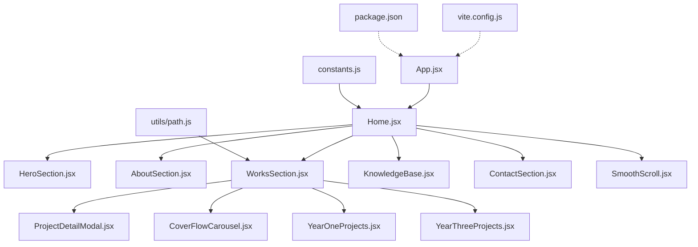
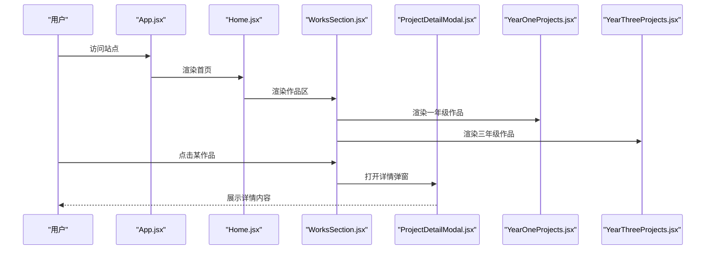
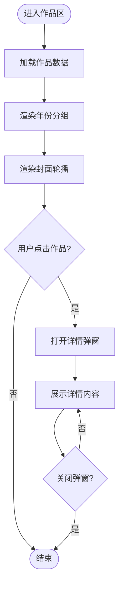
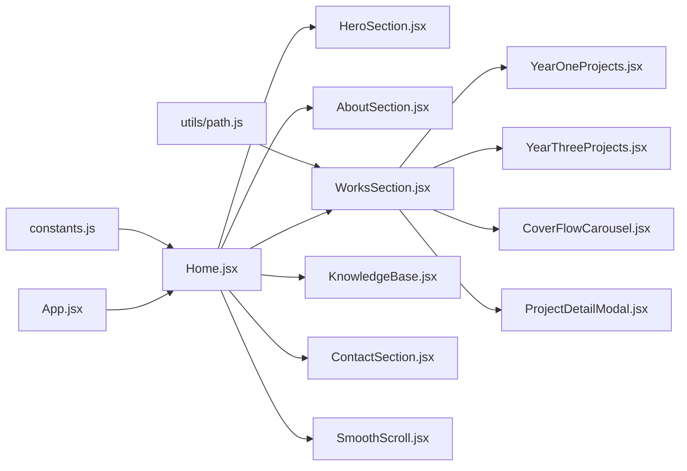

# 核心功能模块

<cite>
**本文引用的文件**   
- [src/App.jsx](file://src/App.jsx)
- [src/Home.jsx](file://src/Home.jsx)
- [src/constants.js](file://src/constants.js)
- [src/utils/path.js](file://src/utils/path.js)
- [src/components/HeroSection.jsx](file://src/components/HeroSection.jsx)
- [src/components/AboutSection.jsx](file://src/components/AboutSection.jsx)
- [src/components/WorksSection.jsx](file://src/components/WorksSection.jsx)
- [src/components/KnowledgeBase.jsx](file://src/components/KnowledgeBase.jsx)
- [src/components/ContactSection.jsx](file://src/components/ContactSection.jsx)
- [src/components/ProjectDetailModal.jsx](file://src/components/ProjectDetailModal.jsx)
- [src/components/CoverFlowCarousel.jsx](file://src/components/CoverFlowCarousel.jsx)
- [src/components/SmoothScroll.jsx](file://src/components/SmoothScroll.jsx)
- [src/components/YearOneProjects.jsx](file://src/components/YearOneProjects.jsx)
- [src/components/YearThreeProjects.jsx](file://src/components/YearThreeProjects.jsx)
- [vite.config.js](file://vite.config.js)
- [package.json](file://package.json)
</cite>

## 目录
1. [简介](#简介)
2. [项目结构](#项目结构)
3. [核心组件](#核心组件)
4. [架构总览](#架构总览)
5. [详细组件分析](#详细组件分析)
6. [依赖关系分析](#依赖关系分析)
7. [性能考虑](#性能考虑)
8. [故障排查指南](#故障排查指南)
9. [结论](#结论)
10. [附录](#附录)

## 简介
本文件聚焦 Goodent 项目的核心功能模块，围绕以下页面与能力进行系统化说明：英雄区域展示、个人介绍、作品展示、知识基础、联系方式等。文档将解释各模块的设计理念、实现方式、交互关系与数据传递机制，并提供响应式布局与跨设备兼容策略、配置项与扩展接口、使用示例路径、性能优化建议（懒加载、代码分割）、常见问题排查与调试技巧，以及最佳实践建议，帮助开发者快速上手并高效定制。

## 项目结构
Goodent 采用基于 React + Vite 的前端工程化方案，核心页面以“区块组件”形式组织，通过路由或条件渲染组合到首页中。关键目录与职责如下：
- src/components：页面级区块组件与通用 UI 组件
- src/utils：工具函数（如路径处理）
- src/constants.js：全局常量与默认配置
- vite.config.js：构建与开发服务器配置
- package.json：依赖与脚本定义

图表来源
- [src/App.jsx](file://src/App.jsx)
- [src/Home.jsx](file://src/Home.jsx)
- [src/components/HeroSection.jsx](file://src/components/HeroSection.jsx)
- [src/components/AboutSection.jsx](file://src/components/AboutSection.jsx)
- [src/components/WorksSection.jsx](file://src/components/WorksSection.jsx)
- [src/components/KnowledgeBase.jsx](file://src/components/KnowledgeBase.jsx)
- [src/components/ContactSection.jsx](file://src/components/ContactSection.jsx)
- [src/components/ProjectDetailModal.jsx](file://src/components/ProjectDetailModal.jsx)
- [src/components/CoverFlowCarousel.jsx](file://src/components/CoverFlowCarousel.jsx)
- [src/components/YearOneProjects.jsx](file://src/components/YearOneProjects.jsx)
- [src/components/YearThreeProjects.jsx](file://src/components/YearThreeProjects.jsx)
- [src/constants.js](file://src/constants.js)
- [src/utils/path.js](file://src/utils/path.js)
- [vite.config.js](file://vite.config.js)
- [package.json](file://package.json)

章节来源
- [src/App.jsx](file://src/App.jsx)
- [src/Home.jsx](file://src/Home.jsx)
- [src/constants.js](file://src/constants.js)
- [src/utils/path.js](file://src/utils/path.js)
- [vite.config.js](file://vite.config.js)
- [package.json](file://package.json)

## 核心组件
本节概述每个主要区块组件的职责、输入输出与典型用法路径。

- 英雄区域 HeroSection
  - 职责：首屏视觉焦点，承载品牌标识、主标题与引导入口
  - 输入：主题色、文案、动效开关、背景资源等
  - 输出：导航锚点跳转、进入其他区块的交互
  - 参考路径：[src/components/HeroSection.jsx](file://src/components/HeroSection.jsx)

- 个人介绍 AboutSection
  - 职责：展示个人背景、技能栈、经历时间线
  - 输入：文本内容、图片、技能标签、时间线数据
  - 输出：点击展开详情、跳转到联系方式
  - 参考路径：[src/components/AboutSection.jsx](file://src/components/AboutSection.jsx)

- 作品展示 WorksSection
  - 职责：聚合作品集，支持分类筛选、轮播与详情弹窗
  - 输入：作品列表、封面图、元信息、分类规则
  - 输出：打开 ProjectDetailModal、切换年份视图
  - 参考路径：[src/components/WorksSection.jsx](file://src/components/WorksSection.jsx)、[src/components/ProjectDetailModal.jsx](file://src/components/ProjectDetailModal.jsx)、[src/components/CoverFlowCarousel.jsx](file://src/components/CoverFlowCarousel.jsx)、[src/components/YearOneProjects.jsx](file://src/components/YearOneProjects.jsx)、[src/components/YearThreeProjects.jsx](file://src/components/YearThreeProjects.jsx)

- 知识基础 KnowledgeBase
  - 职责：结构化呈现知识点、文章或教程卡片
  - 输入：知识条目数组、标签、排序规则
  - 输出：搜索过滤、分页或滚动加载
  - 参考路径：[src/components/KnowledgeBase.jsx](file://src/components/KnowledgeBase.jsx)

- 联系方式 ContactSection
  - 职责：提供联系表单与社交链接
  - 输入：表单字段、校验规则、提交目标
  - 输出：提交结果反馈、外部链接跳转
  - 参考路径：[src/components/ContactSection.jsx](file://src/components/ContactSection.jsx)

- 平滑滚动 SmoothScroll
  - 职责：为锚点跳转提供平滑滚动体验
  - 输入：目标元素选择器、滚动行为参数
  - 输出：无副作用的滚动效果
  - 参考路径：[src/components/SmoothScroll.jsx](file://src/components/SmoothScroll.jsx)

- 全局常量 constants.js
  - 职责：集中管理站点文案、主题、默认配置
  - 参考路径：[src/constants.js](file://src/constants.js)

- 路径工具 utils/path.js
  - 职责：统一资源路径拼接与相对路径解析
  - 参考路径：[src/utils/path.js](file://src/utils/path.js)

章节来源
- [src/components/HeroSection.jsx](file://src/components/HeroSection.jsx)
- [src/components/AboutSection.jsx](file://src/components/AboutSection.jsx)
- [src/components/WorksSection.jsx](file://src/components/WorksSection.jsx)
- [src/components/KnowledgeBase.jsx](file://src/components/KnowledgeBase.jsx)
- [src/components/ContactSection.jsx](file://src/components/ContactSection.jsx)
- [src/components/ProjectDetailModal.jsx](file://src/components/ProjectDetailModal.jsx)
- [src/components/CoverFlowCarousel.jsx](file://src/components/CoverFlowCarousel.jsx)
- [src/components/YearOneProjects.jsx](file://src/components/YearOneProjects.jsx)
- [src/components/YearThreeProjects.jsx](file://src/components/YearThreeProjects.jsx)
- [src/components/SmoothScroll.jsx](file://src/components/SmoothScroll.jsx)
- [src/constants.js](file://src/constants.js)
- [src/utils/path.js](file://src/utils/path.js)

## 架构总览
整体采用“单页应用 + 区块组件”的架构。App 作为根容器，Home 作为首页编排器，按顺序挂载各区块组件；作品模块内部再组合轮播、年份分组与详情弹窗。

图表来源
- [src/App.jsx](file://src/App.jsx)
- [src/Home.jsx](file://src/Home.jsx)
- [src/components/WorksSection.jsx](file://src/components/WorksSection.jsx)
- [src/components/ProjectDetailModal.jsx](file://src/components/ProjectDetailModal.jsx)
- [src/components/YearOneProjects.jsx](file://src/components/YearOneProjects.jsx)
- [src/components/YearThreeProjects.jsx](file://src/components/YearThreeProjects.jsx)

## 详细组件分析

### 英雄区域 HeroSection
- 设计理念：强视觉冲击的首屏，强调品牌与行动号召
- 关键特性
  - 背景与动效可配置
  - 响应式排版与触控友好
  - 锚点导航至下方区块
- 配置项（示例键名）
  - title、subtitle、ctaText、bgImage、animationEnabled
- 自定义方法
  - onCtaClick：自定义跳转逻辑
  - setTheme：动态切换主题
- 使用示例路径
  - [src/components/HeroSection.jsx](file://src/components/HeroSection.jsx)
- 响应式与兼容性
  - 使用相对单位与媒体查询适配不同屏幕
  - 对低性能设备提供降级开关
- 性能优化
  - 背景图懒加载与占位骨架
  - 动画按需启用

章节来源
- [src/components/HeroSection.jsx](file://src/components/HeroSection.jsx)

### 个人介绍 AboutSection
- 设计理念：清晰传达个人背景与能力画像
- 关键特性
  - 时间线与技能标签可视化
  - 可折叠段落与图片画廊
- 配置项（示例键名）
  - bio、timeline、skills、images
- 自定义方法
  - onSkillClick：点击技能标签触发事件
- 使用示例路径
  - [src/components/AboutSection.jsx](file://src/components/AboutSection.jsx)
- 响应式与兼容性
  - 网格布局在移动端自动堆叠
- 性能优化
  - 图片懒加载与尺寸裁剪

章节来源
- [src/components/AboutSection.jsx](file://src/components/AboutSection.jsx)

### 作品展示 WorksSection
- 设计理念：以“年份 + 轮播 + 详情弹窗”的结构组织作品
- 关键特性
  - 年份分组：YearOneProjects、YearThreeProjects
  - 封面流式轮播：CoverFlowCarousel
  - 详情弹窗：ProjectDetailModal
- 数据流
  - 作品数据由 Home 或常量注入
  - 点击作品项触发弹窗状态提升
- 配置项（示例键名）
  - projects、carouselConfig、modalConfig、yearTabs
- 自定义方法
  - onSelectProject：选中作品回调
  - onOpenModal/onCloseModal：控制弹窗
- 使用示例路径
  - [src/components/WorksSection.jsx](file://src/components/WorksSection.jsx)
  - [src/components/YearOneProjects.jsx](file://src/components/YearOneProjects.jsx)
  - [src/components/YearThreeProjects.jsx](file://src/components/YearThreeProjects.jsx)
  - [src/components/CoverFlowCarousel.jsx](file://src/components/CoverFlowCarousel.jsx)
  - [src/components/ProjectDetailModal.jsx](file://src/components/ProjectDetailModal.jsx)
- 响应式与兼容性
  - 轮播在窄屏下减少可见项
  - 触摸滑动与键盘可达性
- 性能优化
  - 列表项虚拟滚动（可选）
  - 大图懒加载与缩略图缓存

图表来源
- [src/components/WorksSection.jsx](file://src/components/WorksSection.jsx)
- [src/components/CoverFlowCarousel.jsx](file://src/components/CoverFlowCarousel.jsx)
- [src/components/ProjectDetailModal.jsx](file://src/components/ProjectDetailModal.jsx)
- [src/components/YearOneProjects.jsx](file://src/components/YearOneProjects.jsx)
- [src/components/YearThreeProjects.jsx](file://src/components/YearThreeProjects.jsx)

章节来源
- [src/components/WorksSection.jsx](file://src/components/WorksSection.jsx)
- [src/components/YearOneProjects.jsx](file://src/components/YearOneProjects.jsx)
- [src/components/YearThreeProjects.jsx](file://src/components/YearThreeProjects.jsx)
- [src/components/CoverFlowCarousel.jsx](file://src/components/CoverFlowCarousel.jsx)
- [src/components/ProjectDetailModal.jsx](file://src/components/ProjectDetailModal.jsx)

### 知识基础 KnowledgeBase
- 设计理念：以卡片/列表形式组织知识条目，便于检索与浏览
- 关键特性
  - 标签筛选、关键词搜索
  - 分页或无限滚动
- 配置项（示例键名）
  - items、tags、pageSize、searchable
- 自定义方法
  - onFilterChange：筛选回调
  - onItemClick：条目点击回调
- 使用示例路径
  - [src/components/KnowledgeBase.jsx](file://src/components/KnowledgeBase.jsx)
- 响应式与兼容性
  - 卡片栅格自适应
- 性能优化
  - 搜索结果去抖
  - 列表项按需渲染

章节来源
- [src/components/KnowledgeBase.jsx](file://src/components/KnowledgeBase.jsx)

### 联系方式 ContactSection
- 设计理念：简洁高效的联系入口
- 关键特性
  - 表单字段与校验
  - 多通道联系方式（邮箱、社交链接）
- 配置项（示例键名）
  - fields、submitUrl、socialLinks
- 自定义方法
  - onSubmit：提交回调
  - onSocialClick：社交链接点击回调
- 使用示例路径
  - [src/components/ContactSection.jsx](file://src/components/ContactSection.jsx)
- 响应式与兼容性
  - 表单控件在大屏横向排列，小屏纵向堆叠
- 性能优化
  - 提交防抖与错误重试

章节来源
- [src/components/ContactSection.jsx](file://src/components/ContactSection.jsx)

### 平滑滚动 SmoothScroll
- 设计理念：改善锚点跳转体验
- 关键特性
  - 监听锚点点击，执行平滑滚动
- 配置项（示例键名）
  - duration、offset、easing
- 使用示例路径
  - [src/components/SmoothScroll.jsx](file://src/components/SmoothScroll.jsx)
- 性能优化
  - 节流滚动事件，避免重排抖动

章节来源
- [src/components/SmoothScroll.jsx](file://src/components/SmoothScroll.jsx)

### 全局常量与路径工具
- constants.js
  - 集中管理站点文案、主题、默认配置，便于统一修改
  - 参考路径：[src/constants.js](file://src/constants.js)
- utils/path.js
  - 统一资源路径拼接，避免硬编码路径问题
  - 参考路径：[src/utils/path.js](file://src/utils/path.js)

章节来源
- [src/constants.js](file://src/constants.js)
- [src/utils/path.js](file://src/utils/path.js)

## 依赖关系分析
- 组件耦合
  - Home 作为编排者，弱耦合地引入各区块组件
  - WorksSection 组合 YearOneProjects、YearThreeProjects、CoverFlowCarousel 与 ProjectDetailModal
- 外部依赖
  - Vite 构建与开发服务器
  - React 生态（组件、状态管理）
- 潜在循环依赖
  - 当前结构未见明显循环引用；若新增跨组件通信，建议使用事件总线或状态提升

图表来源
- [src/App.jsx](file://src/App.jsx)
- [src/Home.jsx](file://src/Home.jsx)
- [src/components/HeroSection.jsx](file://src/components/HeroSection.jsx)
- [src/components/AboutSection.jsx](file://src/components/AboutSection.jsx)
- [src/components/WorksSection.jsx](file://src/components/WorksSection.jsx)
- [src/components/KnowledgeBase.jsx](file://src/components/KnowledgeBase.jsx)
- [src/components/ContactSection.jsx](file://src/components/ContactSection.jsx)
- [src/components/ProjectDetailModal.jsx](file://src/components/ProjectDetailModal.jsx)
- [src/components/CoverFlowCarousel.jsx](file://src/components/CoverFlowCarousel.jsx)
- [src/components/YearOneProjects.jsx](file://src/components/YearOneProjects.jsx)
- [src/components/YearThreeProjects.jsx](file://src/components/YearThreeProjects.jsx)
- [src/constants.js](file://src/constants.js)
- [src/utils/path.js](file://src/utils/path.js)

章节来源
- [src/App.jsx](file://src/App.jsx)
- [src/Home.jsx](file://src/Home.jsx)
- [src/components/WorksSection.jsx](file://src/components/WorksSection.jsx)
- [src/constants.js](file://src/constants.js)
- [src/utils/path.js](file://src/utils/path.js)

## 性能考虑
- 懒加载
  - 图片与视频资源使用懒加载，降低首屏体积
  - 非首屏区块可采用 IntersectionObserver 延迟渲染
- 代码分割
  - 使用动态导入拆分大组件（如 3D 场景、轮播库）
  - 路由级或区块级按需加载
- 渲染优化
  - 列表项虚拟化（长列表）
  - 避免不必要的重渲染（memo、useMemo、useCallback）
- 网络优化
  - 静态资源压缩与缓存策略
  - CDN 加速与 HTTP/2 多路复用
- 构建优化
  - 开启 Tree Shaking 与生产模式压缩
  - 合理分包，减少主包体积

[本节为通用指导，不直接分析具体文件]

## 故障排查指南
- 资源路径错误
  - 检查是否通过 path.js 统一拼接资源路径
  - 确认 public 与 src/assets 的资源访问规则
  - 参考路径：[src/utils/path.js](file://src/utils/path.js)
- 样式冲突与断点异常
  - 检查 CSS 覆盖与媒体查询优先级
  - 在不同视口下验证布局
- 弹窗无法关闭或状态不同步
  - 检查弹窗状态提升与回调是否正确绑定
  - 参考路径：[src/components/ProjectDetailModal.jsx](file://src/components/ProjectDetailModal.jsx)
- 轮播卡顿或触摸失效
  - 检查事件监听释放与节流策略
  - 参考路径：[src/components/CoverFlowCarousel.jsx](file://src/components/CoverFlowCarousel.jsx)
- 表单提交失败
  - 检查网络请求与后端返回格式
  - 增加错误提示与重试机制
  - 参考路径：[src/components/ContactSection.jsx](file://src/components/ContactSection.jsx)
- 构建产物异常
  - 核对 vite.config.js 的别名与插件配置
  - 清理缓存后重新构建
  - 参考路径：[vite.config.js](file://vite.config.js)

章节来源
- [src/utils/path.js](file://src/utils/path.js)
- [src/components/ProjectDetailModal.jsx](file://src/components/ProjectDetailModal.jsx)
- [src/components/CoverFlowCarousel.jsx](file://src/components/CoverFlowCarousel.jsx)
- [src/components/ContactSection.jsx](file://src/components/ContactSection.jsx)
- [vite.config.js](file://vite.config.js)

## 结论
Goodent 的核心模块以清晰的职责边界与松耦合的组织方式实现了完整的个人作品集展示能力。通过统一的常量与路径工具、合理的组件分层与数据流设计，配合懒加载与代码分割等性能策略，可在多设备上获得良好的用户体验。建议在后续迭代中持续完善无障碍支持、国际化与更细粒度的性能监控。

[本节为总结性内容，不直接分析具体文件]

## 附录

### 常用配置项清单（示例键名）
- 全局
  - theme、siteTitle、defaultLang
- 英雄区域
  - title、subtitle、ctaText、bgImage、animationEnabled
- 个人介绍
  - bio、timeline、skills、images
- 作品展示
  - projects、carouselConfig、modalConfig、yearTabs
- 知识基础
  - items、tags、pageSize、searchable
- 联系方式
  - fields、submitUrl、socialLinks

[本节为概念性清单，不直接分析具体文件]

### 使用示例路径
- 在首页引入并配置各区块组件
  - [src/Home.jsx](file://src/Home.jsx)
- 自定义作品数据结构与渲染
  - [src/components/WorksSection.jsx](file://src/components/WorksSection.jsx)
  - [src/components/YearOneProjects.jsx](file://src/components/YearOneProjects.jsx)
  - [src/components/YearThreeProjects.jsx](file://src/components/YearThreeProjects.jsx)
- 调整轮播与弹窗行为
  - [src/components/CoverFlowCarousel.jsx](file://src/components/CoverFlowCarousel.jsx)
  - [src/components/ProjectDetailModal.jsx](file://src/components/ProjectDetailModal.jsx)
- 统一资源路径与常量
  - [src/utils/path.js](file://src/utils/path.js)
  - [src/constants.js](file://src/constants.js)
- 构建与开发配置
  - [vite.config.js](file://vite.config.js)
  - [package.json](file://package.json)

章节来源
- [src/Home.jsx](file://src/Home.jsx)
- [src/components/WorksSection.jsx](file://src/components/WorksSection.jsx)
- [src/components/YearOneProjects.jsx](file://src/components/YearOneProjects.jsx)
- [src/components/YearThreeProjects.jsx](file://src/components/YearThreeProjects.jsx)
- [src/components/CoverFlowCarousel.jsx](file://src/components/CoverFlowCarousel.jsx)
- [src/components/ProjectDetailModal.jsx](file://src/components/ProjectDetailModal.jsx)
- [src/utils/path.js](file://src/utils/path.js)
- [src/constants.js](file://src/constants.js)
- [vite.config.js](file://vite.config.js)
- [package.json](file://package.json)