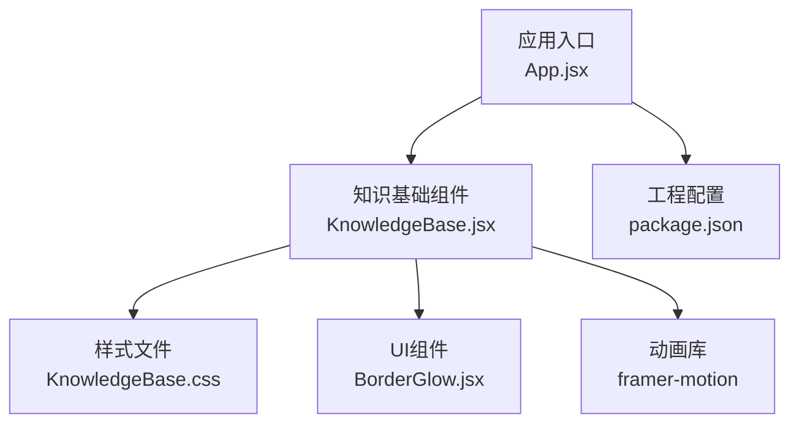
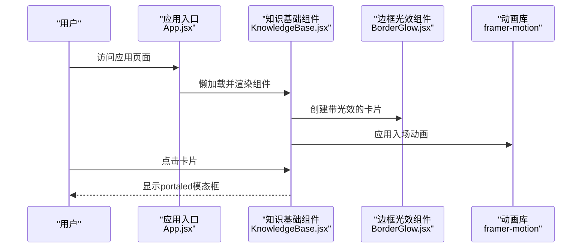
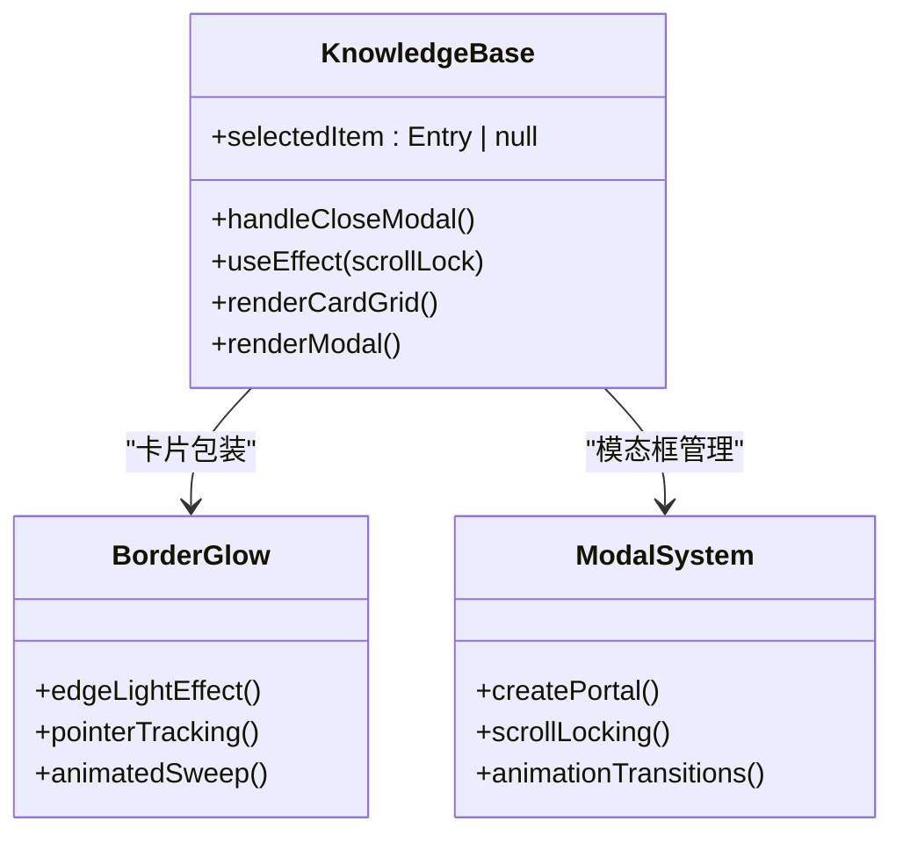
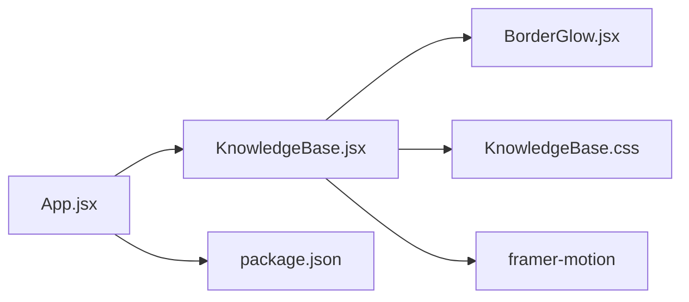

# 知识基础组件

<cite>
**本文引用的文件**   
- [KnowledgeBase.jsx](file://src/components/KnowledgeBase.jsx)
- [KnowledgeBase.css](file://src/components/KnowledgeBase.css)
- [App.jsx](file://src/App.jsx)
- [BorderGlow.jsx](file://src/components/ui/BorderGlow.jsx)
- [package.json](file://package.json)
</cite>

## 更新摘要
**变更内容**   
- KnowledgeBase组件完全重新设计，采用统一的响应式卡片网格布局
- 移除了之前的特色展示/列表分割方法，实现一致的卡片体验
- 模态对话框现在使用React portals确保视口居中显示
- 简化了用户交互流程，专注于内容的清晰展示和高效浏览
- 优化了渲染性能，提升了整体用户体验

## 目录
1. [简介](#简介)
2. [项目结构](#项目结构)
3. [核心组件](#核心组件)
4. [架构总览](#架构总览)
5. [详细组件分析](#详细组件分析)
6. [依赖分析](#依赖分析)
7. [性能考虑](#性能考虑)
8. [故障排查指南](#故障排查指南)
9. [结论](#结论)
10. [附录](#附录)

## 简介
本文件面向开发者与内容运营人员，系统性阐述"知识基础组件"的设计理念、实现方式与使用规范。该组件聚焦于：
- 技术栈展示与学习笔记组织
- 参考资料管理与分类体系
- 动态内容渲染与交互式导航
- 外部资源集成与内容更新流程
- 内容管理最佳实践与SEO优化建议

目标是提供一套可维护、可扩展的知识库构建指南，帮助团队快速搭建高质量的技术知识库。

**更新** 组件已完全重新设计，采用统一的响应式卡片网格布局，移除了复杂的搜索和过滤功能，专注于内容的清晰展示和高效浏览。模态对话框现在使用React portals确保在视口中的完美居中显示。

## 项目结构
本项目采用前端工程化方案（Vite + React），知识基础能力由独立组件封装，并通过应用路由或页面容器进行集成。关键文件职责如下：
- 组件层：KnowledgeBase.jsx 负责知识库的交互逻辑与渲染；KnowledgeBase.css 负责样式
- UI层：BorderGlow.jsx 提供指针跟踪的边缘光效包装器
- 应用层：App.jsx 负责全局路由/布局和懒加载
- 配置层：package.json 为工程配置

**图表来源**
- [App.jsx](file://src/App.jsx)
- [KnowledgeBase.jsx](file://src/components/KnowledgeBase.jsx)
- [KnowledgeBase.css](file://src/components/KnowledgeBase.css)
- [BorderGlow.jsx](file://src/components/ui/BorderGlow.jsx)
- [package.json](file://package.json)

**章节来源**
- [App.jsx](file://src/App.jsx)
- [KnowledgeBase.jsx](file://src/components/KnowledgeBase.jsx)
- [KnowledgeBase.css](file://src/components/KnowledgeBase.css)
- [BorderGlow.jsx](file://src/components/ui/BorderGlow.jsx)
- [package.json](file://package.json)

## 核心组件
本节从设计理念、数据结构、交互流程、扩展点四个维度解析 KnowledgeBase 组件。

- 设计理念
  - 以"条目"为核心实体，围绕"分类-标签-内容"的三元关系组织知识
  - 采用统一的响应式卡片网格布局，提供一致的用户体验
  - 通过React portals确保模态对话框在视口中的完美居中
  - 强调可访问性与SEO友好（语义化标题、结构化元数据）
  - 扁平化布局设计，简化用户操作路径，提升内容浏览效率

- 数据结构设计（概念模型）
  - 条目（Entry）：包含id、label、category、icon、desc、content等字段
  - 分类（Category）：预定义的分类字典，支持颜色映射和中文标签
  - 视图状态（View State）：当前选中的条目、模态框状态
  - 样式系统：CSS变量驱动的动态主题和颜色映射

- 内容分类系统
  - 内置16个分类：硬件、人工智能、机器学习、工程、设计、调研、创业、仿真、测试、运动、生活、安全、开发、机器人、哲学、历史
  - 每个分类都有对应的颜色标识和中文标签
  - 支持自定义分类扩展和颜色映射

- 标签管理与交互
  - 点击卡片打开详情模态框
  - 支持ESC键关闭模态框
  - 自动锁定页面滚动防止背景滚动
  - 平滑的入场和退出动画

- 动态内容渲染
  - 基于条目数据动态生成卡片网格
  - 支持懒加载图片和按需加载详情内容
  - 主题与样式通过CSS变量控制，便于定制
  - 响应式设计适配不同屏幕尺寸

- 外部资源集成
  - 支持外链跳转、内嵌文档预览
  - 统一外链安全策略
  - 资源路径与CDN配置集中在工程配置中

- 内容更新流程
  - 新增/修改条目：直接在knowledgeData数组中增改条目数据
  - 发布流程：本地预览 → 提交代码 → CI 构建 → 部署
  - 版本化：为重要条目添加版本号与变更记录

**章节来源**
- [KnowledgeBase.jsx](file://src/components/KnowledgeBase.jsx)
- [KnowledgeBase.css](file://src/components/KnowledgeBase.css)
- [BorderGlow.jsx](file://src/components/ui/BorderGlow.jsx)

## 架构总览
下图展示了应用层到组件层的调用关系与数据流向。

**图表来源**
- [App.jsx](file://src/App.jsx)
- [KnowledgeBase.jsx](file://src/components/KnowledgeBase.jsx)
- [BorderGlow.jsx](file://src/components/ui/BorderGlow.jsx)

## 详细组件分析

### 组件A：KnowledgeBase 组件
- 职责
  - 管理知识库数据的展示和交互
  - 渲染统一的响应式卡片网格布局
  - 处理模态框的显示和隐藏
  - 管理页面滚动锁定状态
- 关键特性
  - 使用useState管理选中条目状态
  - 使用useCallback优化事件处理函数
  - 使用useEffect管理页面滚动行为
  - 通过createPortal将模态框渲染到body元素
- 错误处理
  - 空数据时显示占位提示
  - 模态框关闭时的状态清理
  - 样式变量的默认值处理

**图表来源**
- [KnowledgeBase.jsx](file://src/components/KnowledgeBase.jsx)
- [BorderGlow.jsx](file://src/components/ui/BorderGlow.jsx)

**章节来源**
- [KnowledgeBase.jsx](file://src/components/KnowledgeBase.jsx)
- [KnowledgeBase.css](file://src/components/KnowledgeBase.css)
- [BorderGlow.jsx](file://src/components/ui/BorderGlow.jsx)

### 组件B：应用集成（App.jsx）
- 职责
  - 全局路由和布局管理
  - 组件懒加载优化
  - 导航系统集成
- 集成要点
  - 使用Suspense包裹KnowledgeBase组件实现懒加载
  - 在导航菜单中添加知识库链接
  - 统一的加载骨架屏处理

**章节来源**
- [App.jsx](file://src/App.jsx)

### 组件C：边框光效组件（BorderGlow.jsx）
- 职责
  - 提供指针跟踪的边缘光效
  - 计算鼠标位置与卡片边缘的距离
  - 动态更新CSS变量实现视觉效果
- 关键特性
  - 实时追踪鼠标位置
  - 计算边缘接近度
  - 支持入场动画效果
  - 高度可定制的视觉参数

**章节来源**
- [BorderGlow.jsx](file://src/components/ui/BorderGlow.jsx)

## 依赖分析
- 内部依赖
  - KnowledgeBase.jsx 依赖 BorderGlow.jsx 的边框光效功能
  - KnowledgeBase.jsx 依赖 KnowledgeBase.css 的样式定义
  - App.jsx 作为容器，负责组件的懒加载和路由
- 外部依赖
  - React 生态（组件、Hooks、Portals）
  - framer-motion 动画库（入场动画、模态框过渡）
  - Vite 构建工具链（开发服务器、打包、插件）

**图表来源**
- [App.jsx](file://src/App.jsx)
- [KnowledgeBase.jsx](file://src/components/KnowledgeBase.jsx)
- [BorderGlow.jsx](file://src/components/ui/BorderGlow.jsx)
- [KnowledgeBase.css](file://src/components/KnowledgeBase.css)
- [package.json](file://package.json)

**章节来源**
- [package.json](file://package.json)

## 性能考虑
- 渲染优化
  - 懒加载：KnowledgeBase组件通过Suspense实现按需加载
  - 虚拟列表：当前所有条目一次性渲染，适合中小规模数据
  - 防抖：滚动事件处理优化，减少重排
- 计算优化
  - useCallback缓存事件处理函数，避免不必要的重新渲染
  - 预计算分类颜色和标签映射
  - 使用useMemo优化重复计算
- 样式与主题
  - 使用CSS变量实现动态主题切换
  - 最小化的类名和样式结构
  - 响应式设计适配不同屏幕尺寸
- 构建与部署
  - 静态资源压缩与CDN缓存
  - 增量构建与缓存命中策略
  - 代码分割和懒加载优化

## 故障排查指南
- 常见问题
  - 模态框未居中：检查createPortal是否正确渲染到document.body
  - 边框光效不工作：确认pointermove事件监听器和CSS变量设置
  - 动画异常：检查framer-motion版本兼容性
  - 样式错乱：核对CSS变量和类名优先级
- 调试建议
  - 在浏览器控制台打印选中条目状态
  - 使用React DevTools观察组件状态变化
  - 针对动画问题开启性能面板定位瓶颈
  - 检查网络请求和资源加载情况

**章节来源**
- [KnowledgeBase.jsx](file://src/components/KnowledgeBase.jsx)
- [KnowledgeBase.css](file://src/components/KnowledgeBase.css)
- [BorderGlow.jsx](file://src/components/ui/BorderGlow.jsx)

## 结论
知识基础组件通过统一的响应式卡片网格布局、React portals模态框系统和现代化的动画效果，为团队提供了高效的知识展示与管理能力。新的架构设计简化了用户交互流程，同时保持了良好的性能和可维护性。遵循本文档的结构化方法与最佳实践，可在保证用户体验的同时，持续扩展知识库规模与功能边界。

## 附录

### 配置示例与最佳实践
- 新增技术条目
  - 在KnowledgeBase.jsx的knowledgeData数组中新增对象
  - 包含必需字段：id、label、category、icon、desc、content
  - 确保category在预定义分类中存在
- 自定义分类结构
  - 在CATEGORY_LABELS中添加新的分类映射
  - 在CATEGORY_COLORS中定义对应的颜色值
  - 保持分类命名的一致性和可读性
- 修改展示样式
  - 在KnowledgeBase.css中调整卡片网格布局
  - 使用CSS变量实现主题切换
  - 优先使用响应式设计原则
- 外部资源集成
  - 外链统一使用安全属性
  - 内嵌文档建议使用沙箱iframe
  - 资源路径统一管理
- 内容更新流程
  - 本地预览 → 提交代码 → 构建部署
  - 重要条目增加版本标记与变更记录
- SEO 优化建议
  - 页面title/description与条目标题对应
  - 使用语义化标签结构
  - 为图片提供alt文本描述
  - 生成站点地图与结构化数据

### 技术特性说明
- **响应式卡片网格**：使用CSS Grid实现自适应布局，支持移动端单列显示
- **React Portals**：确保模态框在DOM树顶层渲染，避免层级问题
- **指针跟踪光效**：实时计算鼠标位置，动态更新CSS变量实现边缘发光效果
- **动画系统**：基于framer-motion实现流畅的入场和过渡动画
- **懒加载优化**：通过React.lazy和Suspense实现组件按需加载

**章节来源**
- [KnowledgeBase.jsx](file://src/components/KnowledgeBase.jsx)
- [KnowledgeBase.css](file://src/components/KnowledgeBase.css)
- [BorderGlow.jsx](file://src/components/ui/BorderGlow.jsx)
- [App.jsx](file://src/App.jsx)
- [package.json](file://package.json)