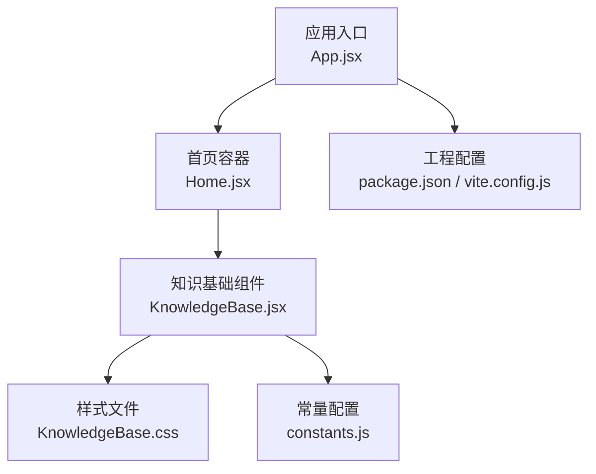
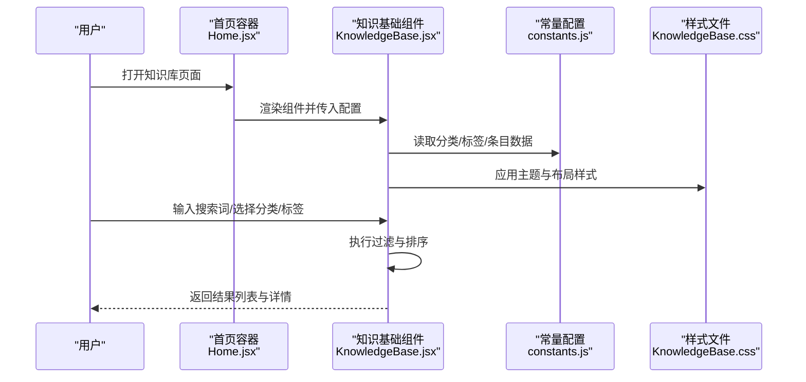
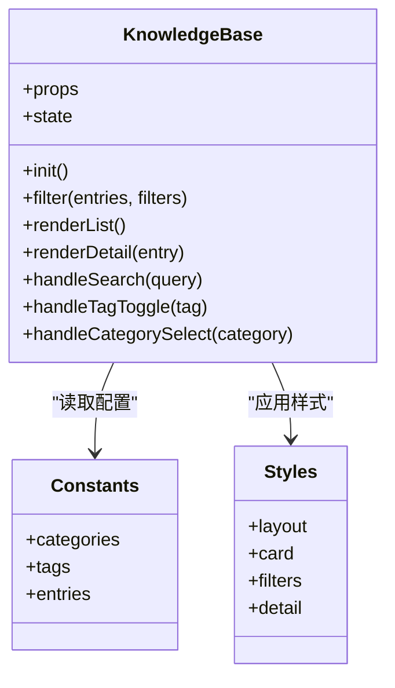
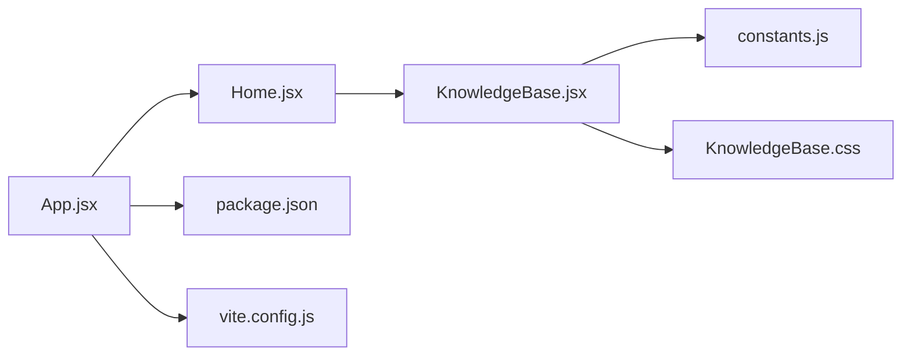

# 知识基础组件

<cite>
**本文引用的文件**   
- [KnowledgeBase.jsx](file://src/components/KnowledgeBase.jsx)
- [KnowledgeBase.css](file://src/components/KnowledgeBase.css)
- [App.jsx](file://src/App.jsx)
- [constants.js](file://src/constants.js)
- [Home.jsx](file://src/Home.jsx)
- [package.json](file://package.json)
- [vite.config.js](file://vite.config.js)
</cite>

## 目录
1. [简介](#简介)
2. [项目结构](#项目结构)
3. [核心组件](#核心组件)
4. [架构总览](#架构总览)
5. [详细组件分析](#详细组件分析)
6. [依赖分析](#依赖分析)
7. [性能考虑](#性能考虑)
8. [故障排查指南](#故障排查指南)
9. [结论](#结论)
10. [附录](#附录)

## 简介
本文件面向开发者与内容运营人员，系统性阐述“知识基础组件”的设计理念、实现方式与使用规范。该组件聚焦于：
- 技术栈展示与学习笔记组织
- 参考资料管理与分类体系
- 动态内容渲染、标签管理与交互式导航
- 搜索与过滤机制
- 外部资源集成与内容更新流程
- 内容管理最佳实践与SEO优化建议

目标是提供一套可维护、可扩展的知识库构建指南，帮助团队快速搭建高质量的技术知识库。

## 项目结构
本项目采用前端工程化方案（Vite + React），知识基础能力由独立组件封装，并通过应用路由或页面容器进行集成。关键文件职责如下：
- 组件层：KnowledgeBase.jsx 负责知识库的交互逻辑与渲染；KnowledgeBase.css 负责样式
- 应用层：App.jsx 负责全局路由/布局；Home.jsx 作为首页入口
- 配置层：constants.js 用于集中配置（如分类、标签、条目元数据等）；package.json 与 vite.config.js 为工程配置

图表来源
- [App.jsx](file://src/App.jsx)
- [Home.jsx](file://src/Home.jsx)
- [KnowledgeBase.jsx](file://src/components/KnowledgeBase.jsx)
- [KnowledgeBase.css](file://src/components/KnowledgeBase.css)
- [constants.js](file://src/constants.js)
- [package.json](file://package.json)
- [vite.config.js](file://vite.config.js)

章节来源
- [App.jsx](file://src/App.jsx)
- [Home.jsx](file://src/Home.jsx)
- [KnowledgeBase.jsx](file://src/components/KnowledgeBase.jsx)
- [KnowledgeBase.css](file://src/components/KnowledgeBase.css)
- [constants.js](file://src/constants.js)
- [package.json](file://package.json)
- [vite.config.js](file://vite.config.js)

## 核心组件
本节从设计理念、数据结构、交互流程、扩展点四个维度解析 KnowledgeBase 组件。

- 设计理念
  - 以“条目”为核心实体，围绕“分类-标签-内容”的三元关系组织知识
  - 通过配置驱动（constants.js）降低硬编码耦合，便于内容运营与维护
  - 支持搜索与多条件过滤，提升检索效率
  - 强调可访问性与SEO友好（语义化标题、结构化元数据）

- 数据结构设计（概念模型）
  - 条目（Entry）：包含标题、摘要、分类、标签、链接、封面图、创建/更新时间等字段
  - 分类（Category）：树形或扁平结构，支持层级与排序
  - 标签（Tag）：扁平集合，支持多选与组合筛选
  - 视图状态（View State）：当前筛选条件、搜索关键词、分页/排序策略

- 内容分类系统
  - 建议在 constants.js 中定义分类字典与层级关系
  - 支持按分类聚合、面包屑导航与侧边栏切换
  - 分类变更应向后兼容，避免破坏既有链接与缓存

- 标签管理与交互
  - 标签可多选，支持“与/或”组合过滤
  - 提供一键清空、全选、最近使用等便捷操作
  - 标签计数与高亮反馈，增强可用性

- 搜索与过滤机制
  - 全文检索：对标题、摘要、标签进行分词匹配
  - 多条件过滤：分类、标签、时间范围、来源类型等
  - 防抖与分页：减少重渲染压力，提升滚动体验

- 动态内容渲染
  - 基于条目元数据动态生成卡片列表与详情面板
  - 支持懒加载图片与按需加载详情内容
  - 主题与样式通过 CSS 变量或类名控制，便于定制

- 外部资源集成
  - 支持外链跳转、内嵌文档预览（iframe）、Markdown 渲染
  - 统一外链安全策略（target="_blank" rel="noopener noreferrer"）
  - 资源路径与CDN配置集中在工程配置中

- 内容更新流程
  - 新增/修改条目：在 constants.js 中增改条目元数据
  - 发布流程：本地预览 → 提交代码 → CI 构建 → 部署
  - 版本化：为重要条目添加版本号与变更记录

章节来源
- [KnowledgeBase.jsx](file://src/components/KnowledgeBase.jsx)
- [KnowledgeBase.css](file://src/components/KnowledgeBase.css)
- [constants.js](file://src/constants.js)

## 架构总览
下图展示了应用层到组件层的调用关系与数据流向。

图表来源
- [Home.jsx](file://src/Home.jsx)
- [KnowledgeBase.jsx](file://src/components/KnowledgeBase.jsx)
- [constants.js](file://src/constants.js)
- [KnowledgeBase.css](file://src/components/KnowledgeBase.css)

## 详细组件分析

### 组件A：KnowledgeBase 组件
- 职责
  - 接收配置与初始状态，维护筛选与搜索状态
  - 渲染分类侧边栏、标签过滤器、搜索结果列表与详情面板
  - 处理用户交互（点击、键盘、滚动）与响应式适配
- 关键方法（概念说明）
  - 初始化：加载分类、标签、条目数据，建立索引
  - 过滤：根据分类、标签、关键词计算候选集
  - 渲染：分批/分页渲染条目卡片，懒加载详情
  - 事件：处理搜索输入、标签切换、分类切换、外链跳转
- 错误处理
  - 空数据：显示占位提示与引导操作
  - 网络异常：重试与降级策略
  - 非法输入：校验与容错提示

图表来源
- [KnowledgeBase.jsx](file://src/components/KnowledgeBase.jsx)
- [constants.js](file://src/constants.js)
- [KnowledgeBase.css](file://src/components/KnowledgeBase.css)

章节来源
- [KnowledgeBase.jsx](file://src/components/KnowledgeBase.jsx)
- [KnowledgeBase.css](file://src/components/KnowledgeBase.css)
- [constants.js](file://src/constants.js)

### 组件B：应用集成（App.jsx / Home.jsx）
- 职责
  - App.jsx：全局路由、布局、主题注入
  - Home.jsx：页面级容器，承载 KnowledgeBase 组件
- 集成要点
  - 将 constants.js 中的配置对象作为 props 传入
  - 在路由守卫中预取必要资源（字体、图标）
  - 在页面头部注入 SEO 元信息（title、description、keywords）

章节来源
- [App.jsx](file://src/App.jsx)
- [Home.jsx](file://src/Home.jsx)

### 组件C：配置中心（constants.js）
- 职责
  - 集中管理分类、标签、条目元数据
  - 提供默认主题与行为开关
- 扩展建议
  - 新增条目：在 entries 数组追加对象，确保必填字段完整
  - 新增分类：在 categories 中添加节点，必要时设置 parent 与 order
  - 新增标签：在 tags 中声明，并在条目中引用
  - 行为开关：如是否启用搜索、是否显示标签计数、是否开启分页

章节来源
- [constants.js](file://src/constants.js)

## 依赖分析
- 内部依赖
  - KnowledgeBase.jsx 依赖 constants.js 的数据结构与默认值
  - KnowledgeBase.jsx 依赖 KnowledgeBase.css 的样式约定
  - Home.jsx 作为容器，负责将配置传递给组件
- 外部依赖
  - React 生态（组件、Hooks、路由）
  - Vite 构建工具链（开发服务器、打包、插件）
  - 可选：Markdown 渲染器、懒加载库、搜索索引库

图表来源
- [App.jsx](file://src/App.jsx)
- [Home.jsx](file://src/Home.jsx)
- [KnowledgeBase.jsx](file://src/components/KnowledgeBase.jsx)
- [constants.js](file://src/constants.js)
- [KnowledgeBase.css](file://src/components/KnowledgeBase.css)
- [package.json](file://package.json)
- [vite.config.js](file://vite.config.js)

章节来源
- [package.json](file://package.json)
- [vite.config.js](file://vite.config.js)

## 性能考虑
- 渲染优化
  - 虚拟列表/分页：当条目数量较大时，仅渲染可视区域
  - 懒加载：图片与详情内容按需加载
  - 防抖：搜索输入与滚动事件去抖，减少重排
- 计算优化
  - 预处理索引：对标题、摘要、标签建立倒排索引，加速检索
  - 缓存过滤结果：相同筛选条件下复用结果
- 样式与主题
  - 使用 CSS 变量与最小化类名，减少样式体积
  - 按需引入第三方样式，避免全局污染
- 构建与部署
  - 静态资源压缩与CDN缓存
  - 增量构建与缓存命中策略

[本节为通用指导，不直接分析具体文件]

## 故障排查指南
- 常见问题
  - 搜索无结果：检查关键词分词与字段映射是否正确
  - 分类/标签未生效：确认 constants.js 中枚举值一致且大小写敏感
  - 外链无法打开：检查 target 与 rel 属性与安全策略
  - 样式错乱：核对 CSS 类名与主题变量覆盖顺序
- 调试建议
  - 在浏览器控制台打印筛选前后数据快照
  - 使用 React DevTools 观察状态变化与重渲染次数
  - 针对大列表开启性能面板，定位瓶颈

章节来源
- [KnowledgeBase.jsx](file://src/components/KnowledgeBase.jsx)
- [KnowledgeBase.css](file://src/components/KnowledgeBase.css)
- [constants.js](file://src/constants.js)

## 结论
知识基础组件通过配置驱动、模块化设计与良好的交互体验，为团队提供了高效的知识组织与检索能力。遵循本文档的结构化方法与最佳实践，可在保证可维护性的同时，持续扩展知识库规模与功能边界。

[本节为总结性内容，不直接分析具体文件]

## 附录

### 配置示例与最佳实践
- 新增技术条目
  - 在 constants.js 的 entries 中新增对象，包含标题、摘要、分类、标签、链接、封面图等字段
  - 为条目添加创建/更新时间，便于排序与审计
- 自定义分类结构
  - 在 categories 中定义层级关系与排序权重
  - 保持分类命名稳定，避免频繁重构导致链接失效
- 修改展示样式
  - 在 KnowledgeBase.css 中调整卡片布局、间距与颜色
  - 优先使用 CSS 变量，便于主题切换与一致性维护
- 外部资源集成
  - 外链统一使用安全属性，避免 XSS 风险
  - 内嵌文档建议使用沙箱 iframe 与白名单域名
- 内容更新流程
  - 本地预览 → 提交代码 → CI 构建 → 部署上线
  - 重要条目增加版本标记与变更记录
- SEO 优化建议
  - 页面 title/description/keywords 与条目标题对应
  - 使用语义化标签（h1-h6、article、section）
  - 为图片提供 alt 文本，为外链提供描述性文本
  - 生成站点地图与结构化数据（JSON-LD）

[本节为通用指导，不直接分析具体文件]