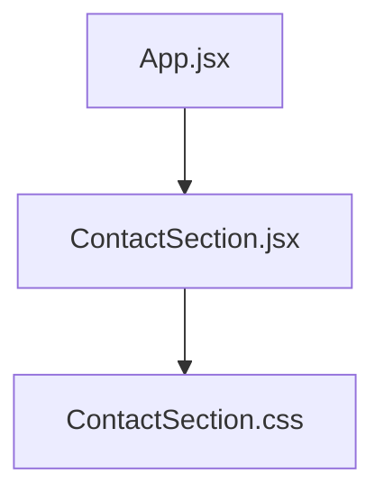
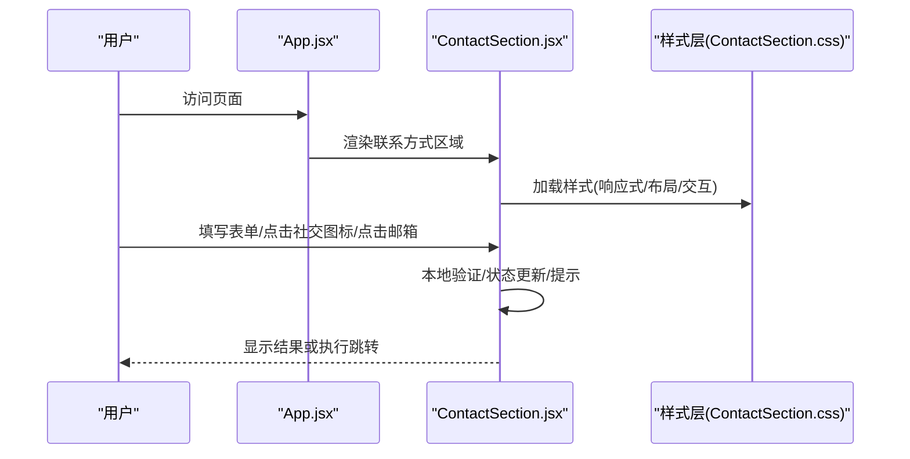
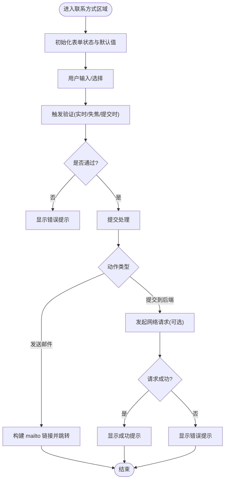
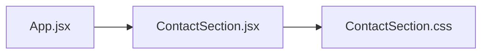

# 联系方式组件

<cite>
**本文引用的文件**   
- [ContactSection.jsx](file://src/components/ContactSection.jsx)
- [ContactSection.css](file://src/components/ContactSection.css)
- [App.jsx](file://src/App.jsx)
</cite>

## 目录
1. [简介](#简介)
2. [项目结构](#项目结构)
3. [核心组件](#核心组件)
4. [架构总览](#架构总览)
5. [详细组件分析](#详细组件分析)
6. [依赖分析](#依赖分析)
7. [性能考虑](#性能考虑)
8. [故障排查指南](#故障排查指南)
9. [结论](#结论)
10. [附录](#附录)

## 简介
本文件为“联系方式组件”的完整技术文档，聚焦于 ContactSection 组件的功能实现与使用指南。内容涵盖联系表单、社交媒体链接、邮箱地址展示、表单验证机制、用户输入处理与错误提示逻辑、社交图标集成与跳转处理、响应式布局与移动端适配、配置示例（自定义联系信息、新增社交平台、修改样式）、前端表单验证最佳实践与用户体验优化方案，以及安全性与隐私保护措施。目标是帮助开发者快速理解并高效定制该模块。

## 项目结构
联系方式相关代码位于 src/components 目录下，包含组件逻辑与样式：
- 组件逻辑：ContactSection.jsx
- 组件样式：ContactSection.css
- 页面集成：App.jsx（用于将 ContactSection 嵌入到应用页面中）

图表来源
- [App.jsx](file://src/App.jsx)
- [ContactSection.jsx](file://src/components/ContactSection.jsx)
- [ContactSection.css](file://src/components/ContactSection.css)

章节来源
- [App.jsx](file://src/App.jsx)
- [ContactSection.jsx](file://src/components/ContactSection.jsx)
- [ContactSection.css](file://src/components/ContactSection.css)

## 核心组件
ContactSection 负责在页面上呈现联系方式区域，包括：
- 联系表单：姓名、邮箱、主题、留言等字段
- 社交媒体链接：平台图标与跳转链接
- 邮箱地址展示：点击可触发邮件客户端
- 表单验证与反馈：实时校验、提交前校验、成功/失败提示
- 响应式布局：适配桌面与移动端

章节来源
- [ContactSection.jsx](file://src/components/ContactSection.jsx)
- [ContactSection.css](file://src/components/ContactSection.css)

## 架构总览
从应用层到组件层的调用关系如下：

图表来源
- [App.jsx](file://src/App.jsx)
- [ContactSection.jsx](file://src/components/ContactSection.jsx)
- [ContactSection.css](file://src/components/ContactSection.css)

## 详细组件分析

### 组件职责与数据流
- 输入收集：通过受控或非受控方式获取表单字段值
- 验证规则：必填项、邮箱格式、长度限制等
- 状态管理：字段值、错误信息、提交状态、成功/失败提示
- 副作用处理：提交后网络请求（如存在）、跳转至 mailto、打开外部链接
- 样式与布局：基于 CSS 的响应式网格/弹性布局，适配不同屏幕尺寸

图表来源
- [ContactSection.jsx](file://src/components/ContactSection.jsx)

章节来源
- [ContactSection.jsx](file://src/components/ContactSection.jsx)

### 表单字段与验证规则
- 字段建议
  - 姓名：必填，长度限制
  - 邮箱：必填，符合邮箱正则
  - 主题：可选，长度限制
  - 留言：必填，最小/最大长度
- 验证时机
  - 实时校验：输入时即时反馈
  - 失焦校验：字段失去焦点时校验
  - 提交校验：统一校验所有字段
- 错误提示
  - 每个字段独立错误消息
  - 全局错误汇总（如提交失败）
  - 成功提示（如提交成功或已复制邮箱）

章节来源
- [ContactSection.jsx](file://src/components/ContactSection.jsx)

### 社交媒体图标与链接跳转
- 图标来源
  - 可使用 SVG 内联图标或第三方图标库（如 React Icons）
- 链接处理
  - 外链使用 target="_blank" rel="noopener noreferrer"
  - 支持 hover 动效与无障碍标签
- 可扩展性
  - 通过配置数组动态渲染社交平台列表
  - 新增平台只需添加条目（名称、URL、图标标识）

章节来源
- [ContactSection.jsx](file://src/components/ContactSection.jsx)

### 邮箱地址展示与交互
- 展示方式
  - 文本展示 + 可点击链接
- 交互行为
  - 点击触发 mailto 协议，唤起系统邮件客户端
  - 可选：一键复制邮箱到剪贴板并提供反馈
- 无障碍
  - 提供 aria-label 与键盘可达性

章节来源
- [ContactSection.jsx](file://src/components/ContactSection.jsx)

### 响应式布局与移动端适配
- 布局策略
  - 使用 Flexbox/Grid 进行两列/单列切换
  - 断点设置：小屏单列，大屏双列
- 交互优化
  - 触摸友好的按钮尺寸与间距
  - 避免在小屏上出现横向滚动
- 样式要点
  - 字体大小、行高、边距随屏幕缩放
  - 图片/图标自适应容器宽度

章节来源
- [ContactSection.css](file://src/components/ContactSection.css)

### 配置示例与定制指南
- 自定义联系信息
  - 通过 props 或配置文件传入邮箱、电话、地址等
  - 示例键名建议：email、phone、address
- 新增社交平台
  - 在社交平台配置数组中添加新条目
  - 示例键名建议：platform、url、icon
- 修改表单样式
  - 调整 ContactSection.css 中的断点、颜色、圆角、阴影等
  - 保持语义化类名以便维护

章节来源
- [ContactSection.jsx](file://src/components/ContactSection.jsx)
- [ContactSection.css](file://src/components/ContactSection.css)

### 前端表单验证最佳实践与用户体验优化
- 最佳实践
  - 渐进式验证：先空值检查，再格式校验
  - 明确错误文案：指出问题与修复建议
  - 防抖输入：减少频繁校验带来的性能开销
  - 禁用提交：未通过校验时禁用提交按钮
- 体验优化
  - 自动聚焦与 Tab 顺序合理
  - 成功/失败状态清晰可见
  - 提供“一键复制邮箱”提升效率
  - 加载态与错误重试机制（如涉及后端）

章节来源
- [ContactSection.jsx](file://src/components/ContactSection.jsx)

### 安全性与隐私保护
- 输入安全
  - 对输入进行基础清洗与转义，防止 XSS
  - 服务端二次校验（若涉及后端）
- 链接安全
  - 外链使用 rel="noopener noreferrer"
  - 避免直接拼接用户输入到 URL
- 隐私保护
  - 不记录敏感信息（如密码）
  - 如需存储，遵循最小化原则与合规要求
  - 提供隐私说明与同意选项（如需要）

章节来源
- [ContactSection.jsx](file://src/components/ContactSection.jsx)

## 依赖分析
- 组件内部依赖
  - 样式依赖：ContactSection.css
- 应用集成依赖
  - 被 App.jsx 引用并渲染

图表来源
- [App.jsx](file://src/App.jsx)
- [ContactSection.jsx](file://src/components/ContactSection.jsx)
- [ContactSection.css](file://src/components/ContactSection.css)

章节来源
- [App.jsx](file://src/App.jsx)
- [ContactSection.jsx](file://src/components/ContactSection.jsx)
- [ContactSection.css](file://src/components/ContactSection.css)

## 性能考虑
- 减少重排重绘
  - 合并状态更新，避免多次 setState
  - 使用 CSS transform 与 opacity 做动画
- 懒加载与按需引入
  - 图标库按需引入，减小包体积
- 事件优化
  - 防抖/节流输入事件
  - 避免在高频事件中执行复杂计算

[本节为通用指导，无需特定文件来源]

## 故障排查指南
- 表单无法提交
  - 检查验证逻辑是否阻止提交
  - 确认必要字段均已填写并通过校验
- 邮箱点击无效
  - 检查 mailto 链接是否正确
  - 确认浏览器/系统是否允许邮件客户端
- 社交链接无响应
  - 检查链接格式与 rel 属性
  - 确认目标站点是否可访问
- 样式错乱
  - 核对断点与媒体查询
  - 检查类名冲突或覆盖

章节来源
- [ContactSection.jsx](file://src/components/ContactSection.jsx)
- [ContactSection.css](file://src/components/ContactSection.css)

## 结论
ContactSection 提供了完整的联系方式展示与交互能力，涵盖表单验证、社交链接、邮箱交互与响应式布局。通过合理的配置与样式定制，可以快速适配不同业务需求。遵循前端验证最佳实践与安全隐私规范，可获得稳定、易用且安全的用户体验。

[本节为总结性内容，无需特定文件来源]

## 附录
- 常用配置键名建议
  - 联系信息：email、phone、address
  - 社交平台：platform、url、icon
  - 表单字段：name、email、subject、message
- 无障碍建议
  - 为交互元素提供 aria-label
  - 确保键盘可达性与焦点可见

[本节为补充信息，无需特定文件来源]