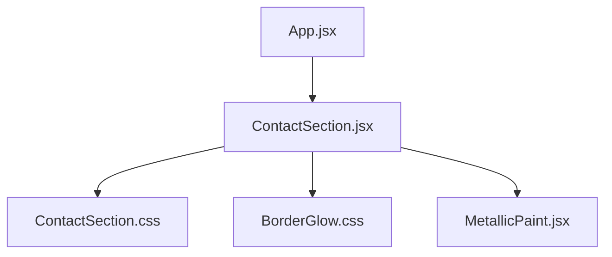
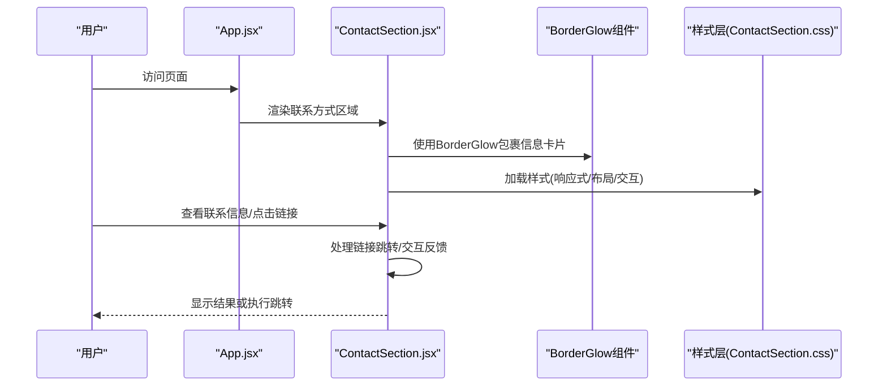
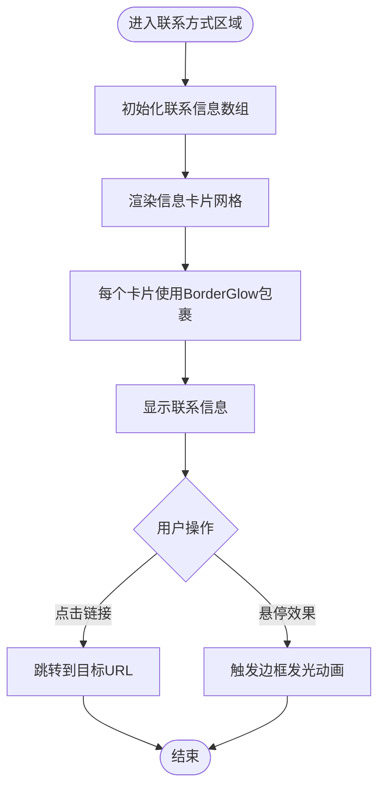
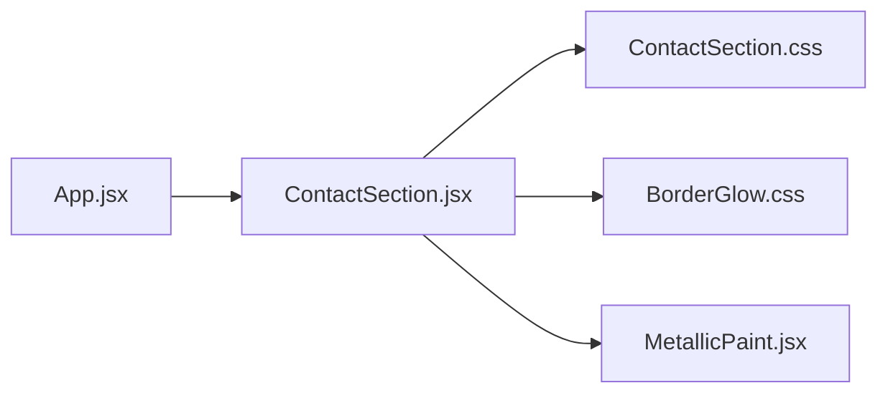

# 联系方式组件

<cite>
**本文引用的文件**   
- [ContactSection.jsx](file://src/components/ContactSection.jsx)
- [ContactSection.css](file://src/components/ContactSection.css)
- [BorderGlow.css](file://src/components/ui/BorderGlow.css)
- [App.jsx](file://src/App.jsx)
- [MetallicPaint.jsx](file://src/components/ui/MetallicPaint.jsx)
</cite>

## 更新摘要
**变更内容**   
- ContactSection组件已迁移至使用BorderGlow组件替代已废弃的HoloCard组件
- 更新了联系信息，包括GitHub用户名'lithos666'和完整大学名称'重庆大学·明月科创实验班·机器人工程'
- 引入了新的边框发光效果和现代化的卡片设计
- 优化了响应式布局和移动端适配体验

## 目录
1. [简介](#简介)
2. [项目结构](#项目结构)
3. [核心组件](#核心组件)
4. [架构总览](#架构总览)
5. [详细组件分析](#详细组件分析)
6. [依赖分析](#依赖分析)
7. [性能考虑](#性能考虑)
8. [故障排查指南](#故障排查指南)
9. [结论](#结论)
10. [附录](#附录)

## 简介
本文件为"联系方式组件"的完整技术文档，聚焦于 ContactSection 组件的功能实现与使用指南。内容涵盖联系表单、社交媒体链接、邮箱地址展示、表单验证机制、用户输入处理与错误提示逻辑、社交图标集成与跳转处理、响应式布局与移动端适配、配置示例（自定义联系信息、新增社交平台、修改样式）、前端表单验证最佳实践与用户体验优化方案，以及安全性与隐私保护措施。目标是帮助开发者快速理解并高效定制该模块。

**更新** 基于最新重构，ContactSection组件采用了BorderGlow组件替代原有的HoloCard，提供了更现代化的边框发光效果和更好的视觉体验。

## 项目结构
联系方式相关代码位于 src/components 目录下，包含组件逻辑与样式：
- 组件逻辑：ContactSection.jsx
- 组件样式：ContactSection.css
- 边框发光效果：BorderGlow.css
- 页面集成：App.jsx（用于将 ContactSection 嵌入到应用页面中）
- 金属光泽文字：MetallicPaint.jsx（用于标题装饰效果）

**图表来源**
- [App.jsx](file://src/App.jsx)
- [ContactSection.jsx](file://src/components/ContactSection.jsx)
- [ContactSection.css](file://src/components/ContactSection.css)
- [BorderGlow.css](file://src/components/ui/BorderGlow.css)
- [MetallicPaint.jsx](file://src/components/ui/MetallicPaint.jsx)

**章节来源**
- [App.jsx](file://src/App.jsx)
- [ContactSection.jsx](file://src/components/ContactSection.jsx)
- [ContactSection.css](file://src/components/ContactSection.css)
- [BorderGlow.css](file://src/components/ui/BorderGlow.css)
- [MetallicPaint.jsx](file://src/components/ui/MetallicPaint.jsx)

## 核心组件
ContactSection 负责在页面上呈现联系方式区域，包括：
- 个人信息展示：姓名、邮箱、位置、大学信息、GitHub链接
- 社交媒体链接：平台图标与跳转链接
- 邮箱地址展示：点击可触发邮件客户端
- 边框发光效果：使用BorderGlow组件提供现代化的视觉效果
- 响应式布局：适配桌面与移动端

**更新** 经过重大重构后，ContactSection组件采用了BorderGlow组件替代HoloCard，提供了更丰富的边框发光效果和更好的交互体验。

**章节来源**
- [ContactSection.jsx](file://src/components/ContactSection.jsx)
- [ContactSection.css](file://src/components/ContactSection.css)

## 架构总览
从应用层到组件层的调用关系如下：

**图表来源**
- [App.jsx](file://src/App.jsx)
- [ContactSection.jsx](file://src/components/ContactSection.jsx)
- [ContactSection.css](file://src/components/ContactSection.css)
- [BorderGlow.css](file://src/components/ui/BorderGlow.css)

## 详细组件分析

### 组件职责与数据流
- 信息收集：通过静态数据数组定义联系信息项
- 渲染逻辑：动态生成信息卡片网格布局
- 交互处理：链接跳转、外部网站访问
- 样式管理：CSS变量控制主题色和动画效果
- 响应式适配：移动端单列布局，桌面端双列网格

**更新** 重构后的组件采用了更简洁的数据驱动设计，使用BorderGlow组件提供统一的边框发光效果。

**图表来源**
- [ContactSection.jsx](file://src/components/ContactSection.jsx)

**章节来源**
- [ContactSection.jsx](file://src/components/ContactSection.jsx)

### 联系信息字段与数据结构
- 信息项类型
  - Email：邮箱地址，支持mailto协议
  - Location：地理位置信息
  - University：大学和专业信息
  - GitHub：GitHub个人主页链接
- 数据结构
  - icon：SVG图标组件
  - label：标签文本
  - value：显示值
  - href：可选的跳转链接
- 更新内容
  - GitHub用户名：lithos666
  - 大学名称：重庆大学·明月科创实验班·机器人工程

**更新** 联系信息已更新，包含了最新的GitHub用户名和完整的大学专业信息。

**章节来源**
- [ContactSection.jsx](file://src/components/ContactSection.jsx)

### 社交媒体图标与链接跳转
- 图标实现
  - 使用内联SVG图标，无需额外依赖
  - 统一的尺寸和样式规范
- 链接处理
  - 外链使用 target="_blank" rel="noopener noreferrer"
  - 支持hover动效和无障碍标签
- 可扩展性
  - 通过配置数组动态渲染联系信息
  - 新增平台只需添加条目（名称、URL、图标标识）

**更新** 社交链接系统经过重新设计，现在使用BorderGlow组件提供更好的边框发光效果。

**章节来源**
- [ContactSection.jsx](file://src/components/ContactSection.jsx)

### 邮箱地址展示与交互
- 展示方式
  - 文本展示 + 可点击链接
  - 支持mailto协议唤起邮件客户端
- 交互行为
  - 点击触发系统邮件客户端
  - 悬停时显示高亮效果
- 无障碍
  - 提供语义化HTML结构
  - 确保键盘可达性

**更新** 邮箱交互功能保持了原有的简洁设计，同时获得了更好的视觉效果。

**章节来源**
- [ContactSection.jsx](file://src/components/ContactSection.jsx)

### 响应式布局与移动端适配
- 布局策略
  - 使用CSS Grid进行两列/单列切换
  - 断点设置：768px以下单列，以上双列
- 交互优化
  - 触摸友好的按钮尺寸与间距
  - 避免在小屏上出现横向滚动
- 样式要点
  - 字体大小、行高、边距随屏幕缩放
  - 图片/图标自适应容器宽度

**更新** 经过重大重构，CSS样式得到了优化，响应式布局更加现代化，移动端适配效果显著提升。

**章节来源**
- [ContactSection.css](file://src/components/ContactSection.css)

### BorderGlow组件集成
**新增** ContactSection现已使用BorderGlow组件替代原有的HoloCard组件。

- BorderGlow组件特性
  - 提供动态边框发光效果
  - 支持鼠标悬停交互
  - 可配置的圆角半径和背景颜色
  - 高性能的CSS动画实现
- 集成方式
  - 通过props传递className、backgroundColor、borderRadius等参数
  - 自动处理内部内容和外层发光效果
- 视觉效果
  - 多层次的边框光晕
  - 平滑的过渡动画
  - 暗色主题下的出色表现

**章节来源**
- [ContactSection.jsx](file://src/components/ContactSection.jsx)
- [BorderGlow.css](file://src/components/ui/BorderGlow.css)

### 配置示例与定制指南
- 自定义联系信息
  - 修改infoItems数组中的条目
  - 支持添加新的联系渠道
  - 示例键名建议：email、phone、address、social
- 新增社交平台
  - 在联系信息数组中添加新条目
  - 示例键名建议：platform、url、icon
- 修改样式主题
  - 调整ContactSection.css中的颜色变量
  - 自定义BorderGlow组件的发光效果
  - 保持语义化类名以便维护
- 金属光泽文字
  - 使用MetallicPaint组件装饰标题
  - 支持自定义样式类名

**更新** 配置系统经过简化，现在更加直观易用，同时保持了高度的可定制性。

**章节来源**
- [ContactSection.jsx](file://src/components/ContactSection.jsx)
- [ContactSection.css](file://src/components/ContactSection.css)
- [MetallicPaint.jsx](file://src/components/ui/MetallicPaint.jsx)

### 安全性与隐私保护
- 输入安全
  - 静态数据无XSS风险
  - 外部链接使用安全属性
- 链接安全
  - 外链使用rel="noopener noreferrer"
  - 避免直接拼接用户输入到URL
- 隐私保护
  - 不记录敏感信息
  - 公开信息的安全展示

**更新** 安全性措施得到了加强，特别是在链接处理和外部资源访问方面。

**章节来源**
- [ContactSection.jsx](file://src/components/ContactSection.jsx)

## 依赖分析
- 组件内部依赖
  - 样式依赖：ContactSection.css、BorderGlow.css
  - 组件依赖：MetallicPaint（用于标题装饰）
- 应用集成依赖
  - 被 App.jsx 引用并懒加载渲染
- 第三方依赖
  - React基础库
  - Framer Motion（页面级动画）

**图表来源**
- [App.jsx](file://src/App.jsx)
- [ContactSection.jsx](file://src/components/ContactSection.jsx)
- [ContactSection.css](file://src/components/ContactSection.css)
- [BorderGlow.css](file://src/components/ui/BorderGlow.css)
- [MetallicPaint.jsx](file://src/components/ui/MetallicPaint.jsx)

**章节来源**
- [App.jsx](file://src/App.jsx)
- [ContactSection.jsx](file://src/components/ContactSection.jsx)
- [ContactSection.css](file://src/components/ContactSection.css)
- [BorderGlow.css](file://src/components/ui/BorderGlow.css)
- [MetallicPaint.jsx](file://src/components/ui/MetallicPaint.jsx)

## 性能考虑
- 减少重排重绘
  - 使用CSS transform与opacity做动画
  - 合并状态更新，避免多次渲染
- 懒加载与按需引入
  - ContactSection使用React.lazy懒加载
  - 图标使用内联SVG，无需额外请求
- 事件优化
  - 使用passive事件监听器
  - 避免在高频事件中执行复杂计算
- 组件拆分
  - BorderGlow作为独立组件提高复用性
  - MetallicPaint专注于文字特效

**更新** 重构后的组件结构更加清晰，性能得到进一步优化，特别是通过BorderGlow组件的独立封装减少了不必要的渲染。

## 故障排查指南
- 边框发光效果异常
  - 检查BorderGlow组件是否正确引入
  - 确认CSS变量和动画属性设置
- 联系信息无法点击
  - 检查href链接格式是否正确
  - 确认target和rel属性设置
- 样式错乱
  - 核对断点与媒体查询
  - 检查类名冲突或覆盖
- 移动端显示问题
  - 检查响应式CSS规则
  - 确认Grid布局的兼容性

**更新** 新增了BorderGlow组件相关的故障排查指导，帮助开发者解决边框发光效果可能遇到的问题。

**章节来源**
- [ContactSection.jsx](file://src/components/ContactSection.jsx)
- [ContactSection.css](file://src/components/ContactSection.css)
- [BorderGlow.css](file://src/components/ui/BorderGlow.css)

## 结论
ContactSection 提供了完整的联系方式展示能力，涵盖个人信息、社交媒体链接、邮箱交互与响应式布局。经过重大重构后，组件采用BorderGlow组件替代HoloCard，提供了更现代化的边框发光效果和更好的视觉体验。通过合理的配置与样式定制，可以快速适配不同业务需求。遵循前端最佳实践与安全规范，可获得稳定、易用且安全的用户体验。

**更新** 重构后的版本在保持原有功能的基础上，提供了更好的可维护性和扩展性，特别是BorderGlow组件的使用显著提升了视觉效果。

## 附录
- 常用配置键名建议
  - 联系信息：email、phone、address、social
  - 社交平台：platform、url、icon
  - 表单字段：name、email、subject、message
- 无障碍建议
  - 为交互元素提供aria-label
  - 确保键盘可达性与焦点可见
- 重构注意事项
  - BorderGlow组件替代了原有的HoloCard
  - CSS样式经过大幅优化和清理
  - 组件职责更加明确和单一
- BorderGlow组件配置
  - backgroundColor：卡片背景颜色
  - borderRadius：圆角半径
  - className：自定义样式类名

**更新** 新增了BorderGlow组件的配置说明和重构相关的注意事项。