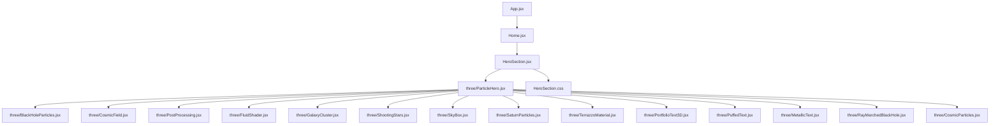
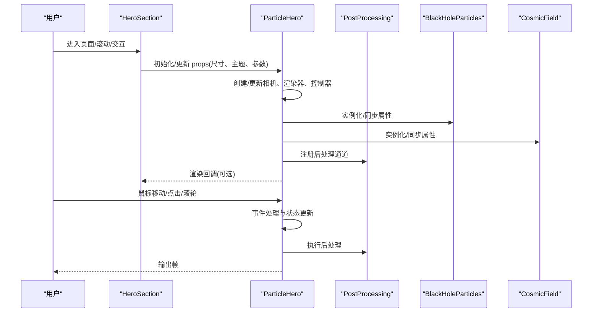
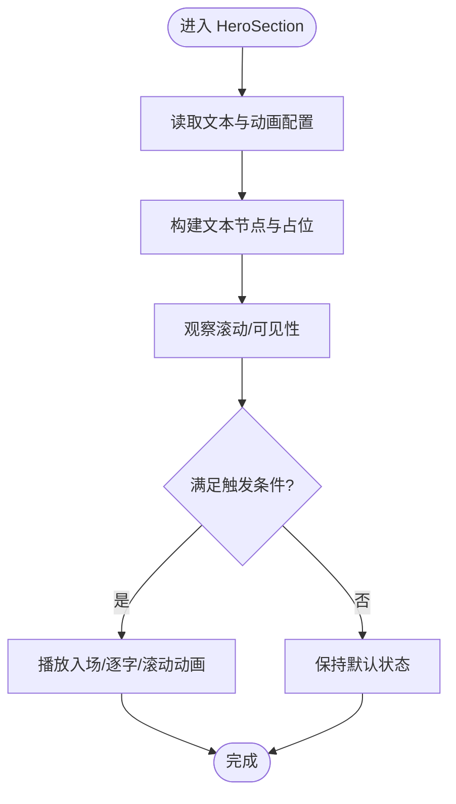
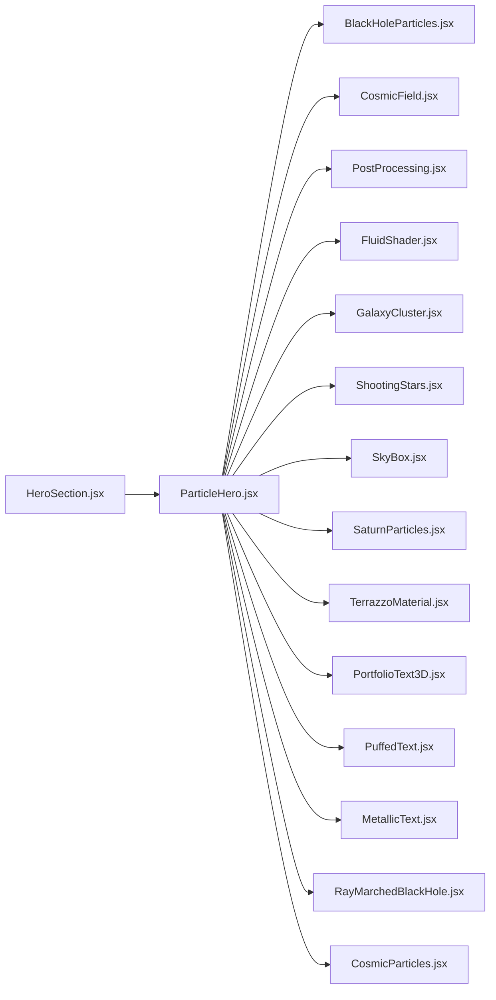

# 英雄区域组件

<cite>
**本文引用的文件**   
- [HeroSection.jsx](file://src/components/HeroSection.jsx)
- [HeroSection.css](file://src/components/HeroSection.css)
- [ParticleHero.jsx](file://src/components/three/ParticleHero.jsx)
- [BlackHoleParticles.jsx](file://src/components/three/BlackHoleParticles.jsx)
- [CosmicField.jsx](file://src/components/three/CosmicField.jsx)
- [PostProcessing.jsx](file://src/components/three/PostProcessing.jsx)
- [FluidShader.jsx](file://src/components/three/FluidShader.jsx)
- [GalaxyCluster.jsx](file://src/components/three/GalaxyCluster.jsx)
- [ShootingStars.jsx](file://src/components/three/ShootingStars.jsx)
- [SkyBox.jsx](file://src/components/three/SkyBox.jsx)
- [SaturnParticles.jsx](file://src/components/three/SaturnParticles.jsx)
- [TerrazzoMaterial.jsx](file://src/components/three/TerrazzoMaterial.jsx)
- [PortfolioText3D.jsx](file://src/components/three/PortfolioText3D.jsx)
- [PuffedText.jsx](file://src/components/three/PuffedText.jsx)
- [MetallicText.jsx](file://src/components/three/MetallicText.jsx)
- [RayMarchedBlackHole.jsx](file://src/components/three/RayMarchedBlackHole.jsx)
- [CosmicParticles.jsx](file://src/components/three/CosmicParticles.jsx)
- [App.jsx](file://src/App.jsx)
- [Home.jsx](file://src/Home.jsx)
</cite>

## 目录
1. [简介](#简介)
2. [项目结构](#项目结构)
3. [核心组件](#核心组件)
4. [架构总览](#架构总览)
5. [详细组件分析](#详细组件分析)
6. [依赖关系分析](#依赖关系分析)
7. [性能考虑](#性能考虑)
8. [故障排查指南](#故障排查指南)
9. [结论](#结论)
10. [附录](#附录)

## 简介
本文件为“英雄区域组件”的完整技术文档，聚焦于 HeroSection 组件及其 Three.js 3D 背景生态。内容涵盖：
- 组件职责与整体架构
- 3D 粒子背景（BlackHoleParticles、CosmicField 等）实现原理
- 文本动画与响应式布局策略
- Props 配置项、事件处理机制与自定义方法
- 集成方案与渲染管线（Three.js + PostProcessing）
- 性能优化（WebGL、内存管理、资源加载）
- 常见问题排查与调试技巧
- 使用示例与最佳实践

## 项目结构
英雄区域位于 src/components 下，包含主容器组件与样式文件；3D 效果由 src/components/three 下的多个子组件构成，分别负责不同视觉主题或特效。应用入口通过 App.jsx 与 Home.jsx 组合这些模块。

图表来源
- [App.jsx](file://src/App.jsx)
- [Home.jsx](file://src/Home.jsx)
- [HeroSection.jsx](file://src/components/HeroSection.jsx)
- [HeroSection.css](file://src/components/HeroSection.css)
- [ParticleHero.jsx](file://src/components/three/ParticleHero.jsx)
- [BlackHoleParticles.jsx](file://src/components/three/BlackHoleParticles.jsx)
- [CosmicField.jsx](file://src/components/three/CosmicField.jsx)
- [PostProcessing.jsx](file://src/components/three/PostProcessing.jsx)
- [FluidShader.jsx](file://src/components/three/FluidShader.jsx)
- [GalaxyCluster.jsx](file://src/components/three/GalaxyCluster.jsx)
- [ShootingStars.jsx](file://src/components/three/ShootingStars.jsx)
- [SkyBox.jsx](file://src/components/three/SkyBox.jsx)
- [SaturnParticles.jsx](file://src/components/three/SaturnParticles.jsx)
- [TerrazzoMaterial.jsx](file://src/components/three/TerrazzoMaterial.jsx)
- [PortfolioText3D.jsx](file://src/components/three/PortfolioText3D.jsx)
- [PuffedText.jsx](file://src/components/three/PuffedText.jsx)
- [MetallicText.jsx](file://src/components/three/MetallicText.jsx)
- [RayMarchedBlackHole.jsx](file://src/components/three/RayMarchedBlackHole.jsx)
- [CosmicParticles.jsx](file://src/components/three/CosmicParticles.jsx)

章节来源
- [HeroSection.jsx](file://src/components/HeroSection.jsx)
- [HeroSection.css](file://src/components/HeroSection.css)
- [App.jsx](file://src/App.jsx)
- [Home.jsx](file://src/Home.jsx)

## 核心组件
- HeroSection：页面首屏容器，负责布局、文本层与 3D 场景的叠加、响应式适配与交互事件分发。
- ParticleHero：Three.js 场景编排器，挂载相机、渲染器、控制器与后处理，并组合多种 3D 特效子组件。
- BlackHoleParticles / CosmicField / GalaxyCluster / ShootingStars / SkyBox / SaturnParticles / TerrazzoMaterial / PortfolioText3D / PuffedText / MetallicText / RayMarchedBlackHole / CosmicParticles：各独立视觉模块，提供可插拔的 3D 材质、几何体、着色器与动画逻辑。
- PostProcessing：统一的后处理通道（如 Bloom、色调映射、景深等），提升画面质感。

章节来源
- [HeroSection.jsx](file://src/components/HeroSection.jsx)
- [ParticleHero.jsx](file://src/components/three/ParticleHero.jsx)
- [BlackHoleParticles.jsx](file://src/components/three/BlackHoleParticles.jsx)
- [CosmicField.jsx](file://src/components/three/CosmicField.jsx)
- [PostProcessing.jsx](file://src/components/three/PostProcessing.jsx)

## 架构总览
HeroSection 作为 UI 层与 3D 层的桥接点，将 DOM 文本与 Three.js 场景进行合成。ParticleHero 负责初始化 WebGL 上下文、创建渲染循环、绑定鼠标/触摸事件，并将各类 3D 特效以图层方式叠加。PostProcessing 在最终输出前对帧缓冲进行增强。

图表来源
- [HeroSection.jsx](file://src/components/HeroSection.jsx)
- [ParticleHero.jsx](file://src/components/three/ParticleHero.jsx)
- [PostProcessing.jsx](file://src/components/three/PostProcessing.jsx)
- [BlackHoleParticles.jsx](file://src/components/three/BlackHoleParticles.jsx)
- [CosmicField.jsx](file://src/components/three/CosmicField.jsx)

## 详细组件分析

### HeroSection 组件
- 职责
  - 首屏布局与层级管理：DOM 文本层覆盖在 3D 画布之上。
  - 响应式适配：监听窗口尺寸变化，驱动 3D 场景重算。
  - 事件透传：将鼠标/触摸事件转发给 3D 层，用于交互（如视差、旋转）。
  - 主题与文案：通过 props 控制标题、副标题、CTA 按钮等。
- 关键能力
  - 文本动画：入场、逐字/逐行显示、滚动触发动画。
  - 可访问性：语义化标签、键盘导航、对比度与可读性。
  - 性能开关：根据设备能力动态降级（关闭部分特效）。
- 典型 Props（概念说明）
  - 文本类：标题、副标题、描述、按钮文案。
  - 主题类：主色、背景透明度、字体族、字号断点。
  - 3D 类：是否启用 3D、粒子密度、光照强度、后处理开关。
  - 交互类：鼠标灵敏度、滚动偏移、点击回调。
- 事件与回调
  - onReady：3D 场景就绪回调。
  - onClick：按钮点击事件。
  - onScroll：滚动位置变化（用于触发文本动画）。
- 样式要点
  - 全屏容器、z-index 分层、移动端安全区适配。
  - 文本阴影与描边确保在复杂背景下可读。

章节来源
- [HeroSection.jsx](file://src/components/HeroSection.jsx)
- [HeroSection.css](file://src/components/HeroSection.css)

### ParticleHero 场景编排器
- 职责
  - 生命周期：挂载时创建 Three.js 对象，卸载时释放资源。
  - 渲染循环：requestAnimationFrame 驱动，按帧更新所有子系统。
  - 事件系统：捕获指针事件，转换为 3D 坐标并影响场景。
  - 后处理：串联 Bloom、色调映射、抗锯齿等通道。
- 关键能力
  - 多分辨率适配：根据 DPR 与屏幕尺寸调整像素比与裁剪。
  - 模块化组合：按需引入 BlackHoleParticles、CosmicField 等。
  - 性能监控：FPS 统计、显存占用提示（开发模式）。
- 典型 Props（概念说明）
  - 场景参数：粒子数量、速度范围、噪声强度、时间缩放。
  - 相机参数：FOV、近/远裁剪面、初始位置与目标。
  - 光照参数：环境光、方向光、点光源强度与颜色。
  - 后处理参数：Bloom 阈值、强度、半径。
- 事件与回调
  - onFrame：每帧回调（可用于外部同步动画）。
  - onResize：尺寸变化回调。
  - onPointerMove/Click：指针事件回调。

章节来源
- [ParticleHero.jsx](file://src/components/three/ParticleHero.jsx)

### BlackHoleParticles 黑洞粒子
- 职责
  - 基于粒子系统的引力场模拟，形成向中心汇聚的视觉效果。
  - 支持颜色渐变、大小分布、速度衰减与拖尾。
- 关键能力
  - 顶点着色器：计算径向速度与扰动。
  - 片段着色器：混合颜色与透明度，模拟辉光。
  - 物理步进：每帧更新位置与速度，避免过度 CPU 开销。
- 典型 Props（概念说明）
  - 粒子数、半径范围、中心引力强度、噪声频率。
  - 颜色渐变数组、透明度曲线、拖尾长度。
- 性能建议
  - 使用 BufferGeometry 与 ShaderMaterial。
  - 合理设置最大粒子数与 LOD。

章节来源
- [BlackHoleParticles.jsx](file://src/components/three/BlackHoleParticles.jsx)

### CosmicField 宇宙场
- 职责
  - 生成大规模随机粒子场，营造星空/星云氛围。
  - 支持缓慢自转与视差位移。
- 关键能力
  - 空间分桶：减少不必要的距离计算。
  - 纹理贴图：使用程序化噪点纹理替代高分辨率图片。
- 典型 Props（概念说明）
  - 密度、尺度、旋转速度、颜色调色板。
- 性能建议
  - 合并批次绘制，减少 draw call。

章节来源
- [CosmicField.jsx](file://src/components/three/CosmicField.jsx)

### PostProcessing 后处理
- 职责
  - 在最终输出前对帧缓冲进行增强，提升观感。
- 常见通道
  - Bloom：泛光效果。
  - ToneMapping：色调映射，提高动态范围。
  - FXAA/SSAO：抗锯齿与环境遮蔽（可选）。
- 典型 Props（概念说明）
  - 强度、阈值、半径、采样次数。
- 性能建议
  - 低配设备禁用或降低强度。
  - 使用较低分辨率的中间缓冲。

章节来源
- [PostProcessing.jsx](file://src/components/three/PostProcessing.jsx)

### 其他 3D 特效组件（概览）
- FluidShader：流体着色器，适合做动态背景。
- GalaxyCluster：星系聚类，呈现星团结构。
- ShootingStars：流星轨迹，增加动感。
- SkyBox：天空盒，提供远景环境。
- SaturnParticles：土星环风格粒子带。
- TerrazzoMaterial：水磨石材质，用于装饰元素。
- PortfolioText3D / PuffedText / MetallicText：3D 文字与金属质感。
- RayMarchedBlackHole：光线步进黑洞，高保真但更耗资源。
- CosmicParticles：通用宇宙粒子集合。

章节来源
- [FluidShader.jsx](file://src/components/three/FluidShader.jsx)
- [GalaxyCluster.jsx](file://src/components/three/GalaxyCluster.jsx)
- [ShootingStars.jsx](file://src/components/three/ShootingStars.jsx)
- [SkyBox.jsx](file://src/components/three/SkyBox.jsx)
- [SaturnParticles.jsx](file://src/components/three/SaturnParticles.jsx)
- [TerrazzoMaterial.jsx](file://src/components/three/TerrazzoMaterial.jsx)
- [PortfolioText3D.jsx](file://src/components/three/PortfolioText3D.jsx)
- [PuffedText.jsx](file://src/components/three/PuffedText.jsx)
- [MetallicText.jsx](file://src/components/three/MetallicText.jsx)
- [RayMarchedBlackHole.jsx](file://src/components/three/RayMarchedBlackHole.jsx)
- [CosmicParticles.jsx](file://src/components/three/CosmicParticles.jsx)

### 文本动画流程（概念）

[此图为概念流程图，不直接对应具体源码文件]

## 依赖关系分析
- 组件耦合
  - HeroSection 与 ParticleHero 松耦合，通过 props 传递配置与回调。
  - ParticleHero 聚合多个 3D 特效组件，采用组合而非继承。
- 外部依赖
  - Three.js 生态：场景、相机、渲染器、控制器、后处理库。
  - 浏览器 API：Canvas/WebGL、Pointer Events、ResizeObserver。
- 潜在循环依赖
  - 当前结构为单向组合，未见循环引用。

图表来源
- [HeroSection.jsx](file://src/components/HeroSection.jsx)
- [ParticleHero.jsx](file://src/components/three/ParticleHero.jsx)
- [BlackHoleParticles.jsx](file://src/components/three/BlackHoleParticles.jsx)
- [CosmicField.jsx](file://src/components/three/CosmicField.jsx)
- [PostProcessing.jsx](file://src/components/three/PostProcessing.jsx)
- [FluidShader.jsx](file://src/components/three/FluidShader.jsx)
- [GalaxyCluster.jsx](file://src/components/three/GalaxyCluster.jsx)
- [ShootingStars.jsx](file://src/components/three/ShootingStars.jsx)
- [SkyBox.jsx](file://src/components/three/SkyBox.jsx)
- [SaturnParticles.jsx](file://src/components/three/SaturnParticles.jsx)
- [TerrazzoMaterial.jsx](file://src/components/three/TerrazzoMaterial.jsx)
- [PortfolioText3D.jsx](file://src/components/three/PortfolioText3D.jsx)
- [PuffedText.jsx](file://src/components/three/PuffedText.jsx)
- [MetallicText.jsx](file://src/components/three/MetallicText.jsx)
- [RayMarchedBlackHole.jsx](file://src/components/three/RayMarchedBlackHole.jsx)
- [CosmicParticles.jsx](file://src/components/three/CosmicParticles.jsx)

章节来源
- [HeroSection.jsx](file://src/components/HeroSection.jsx)
- [ParticleHero.jsx](file://src/components/three/ParticleHero.jsx)

## 性能考虑
- WebGL 渲染优化
  - 使用 BufferGeometry 与 ShaderMaterial 减少 CPU-GPU 数据拷贝。
  - 合并几何体与材质批次，降低 draw call。
  - 限制 DPR 上限（例如不超过 2），避免高分屏过载。
- 内存管理
  - 组件卸载时销毁场景、释放纹理与缓冲区。
  - 复用纹理与材质实例，避免重复创建。
- 资源加载策略
  - 懒加载重型特效（如 RayMarchedBlackHole），仅在高性能设备上启用。
  - 使用程序化纹理替代大体积图片，按需生成。
- 动画与计算
  - 将大量计算移至 GPU（着色器），CPU 仅维护少量状态。
  - 使用节流/防抖处理高频事件（如鼠标移动）。
- 后处理
  - 降低后处理通道分辨率或使用轻量通道。
  - 在低端设备上关闭 Bloom 或降低强度。

[本节为通用指导，无需特定源码引用]

## 故障排查指南
- 黑屏或无渲染
  - 检查 Canvas 容器尺寸是否为 0。
  - 确认 WebGL 上下文可用（某些企业网络会禁用）。
- 卡顿或掉帧
  - 降低粒子数量与后处理强度。
  - 检查是否存在每帧分配内存导致的 GC 抖动。
- 文本不可读
  - 调整文本阴影、描边与背景透明度。
  - 在高对比度模式下验证可读性。
- 交互异常
  - 校验指针事件坐标转换逻辑。
  - 避免事件冒泡导致上层 DOM 拦截。
- 内存泄漏
  - 确认组件卸载时清理了渲染循环与事件监听。
  - 检查纹理与几何体是否正确释放。

章节来源
- [HeroSection.jsx](file://src/components/HeroSection.jsx)
- [ParticleHero.jsx](file://src/components/three/ParticleHero.jsx)

## 结论
HeroSection 通过清晰的层次划分与模块化 3D 组件，实现了高性能且可定制的视觉体验。借助 ParticleHero 的场景编排与 PostProcessing 的画面增强，开发者可在保证性能的前提下灵活组合多种特效。遵循本文的性能与排障建议，可获得稳定流畅的首屏表现。

[本节为总结，无需特定源码引用]

## 附录

### 使用示例（步骤指引）
- 基础用法
  - 在页面中引入 HeroSection，传入标题、副标题与按钮文案。
  - 选择一种 3D 主题（如黑洞或宇宙场），并通过 props 开启。
- 定制视觉效果
  - 调整粒子密度、颜色渐变与拖尾长度。
  - 修改 Bloom 强度与阈值以获得不同质感。
- 调整动画参数
  - 控制入场时长、延迟与缓动函数。
  - 根据滚动位置触发不同的文本动画阶段。
- 修改样式主题
  - 通过 CSS 变量或主题对象覆盖主色、字体与间距。
  - 针对移动端调整字号与安全区。

[本节为使用指引，不直接展示代码内容]

### 最佳实践建议
- 渐进增强：优先保证文本可读性与基本交互，再逐步启用 3D 特效。
- 设备分级：根据设备能力动态切换特效等级。
- 可访问性：确保键盘可达、屏幕阅读器友好、色彩对比度达标。
- 可观测性：在生产环境收集 FPS 与错误日志，持续优化。

[本节为最佳实践，无需特定源码引用]