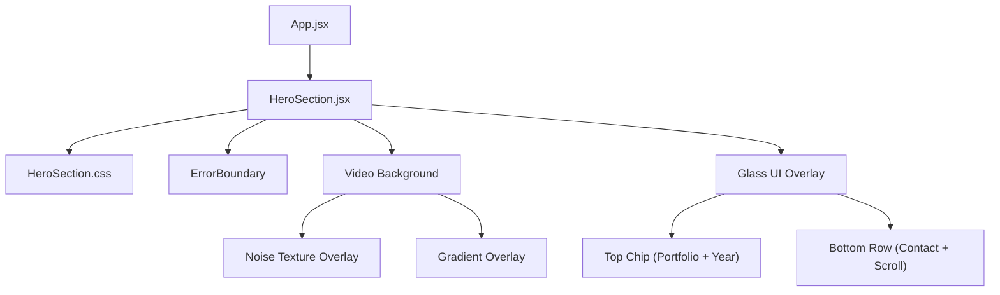
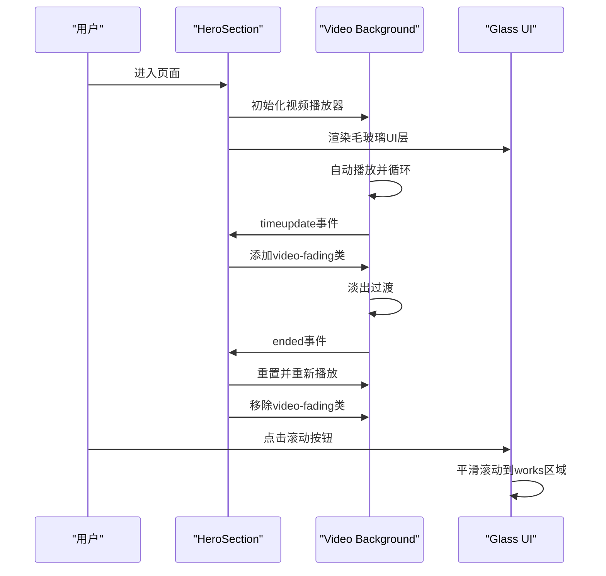
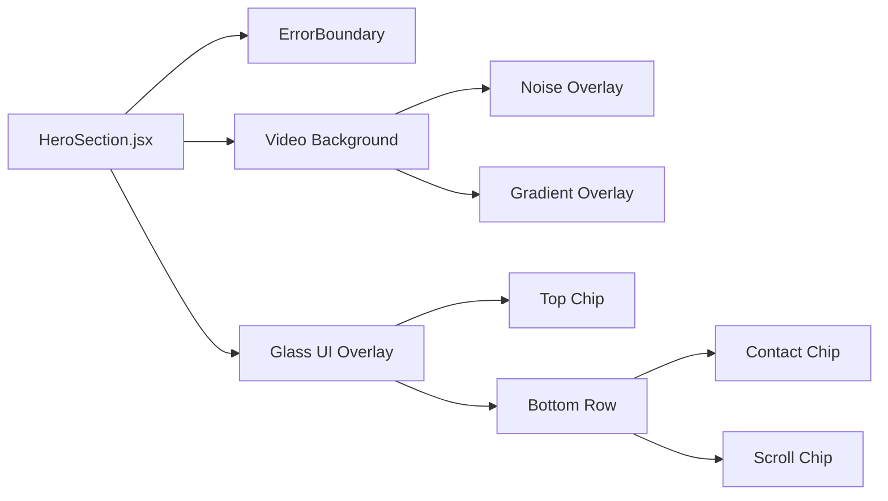

# 英雄区域组件

<cite>
**本文引用的文件**   
- [HeroSection.jsx](file://src/components/HeroSection.jsx)
- [HeroSection.css](file://src/components/HeroSection.css)
- [App.jsx](file://src/App.jsx)
- [WorksSection.jsx](file://src/components/WorksSection.jsx)
</cite>

## 更新摘要
**变更内容**   
- 移除了所有Three.js依赖和3D粒子背景效果
- 实现了视频淡入淡出过渡效果，提升用户体验
- 改进了事件监听器的正确清理机制，防止内存泄漏
- CSS类名从'blackhole-backdrop'重命名为'hero-backdrop'
- 采用CSS特效替代Three.js，保持视觉质量的同时提升性能
- 简化了组件架构，专注于视频背景和毛玻璃UI效果

## 目录
1. [简介](#简介)
2. [项目结构](#项目结构)
3. [核心组件](#核心组件)
4. [架构总览](#架构总览)
5. [详细组件分析](#详细组件分析)
6. [依赖关系分析](#依赖关系分析)
7. [性能考虑](#性能考虑)
8. [故障排查指南](#故障排查指南)
9. [结论](#结论)
10. [附录](#附录)

## 简介
本文件为"英雄区域组件"的完整技术文档，聚焦于HeroSection组件及其现代化的视频背景实现。内容涵盖：
- 组件职责与整体架构
- 视频背景系统与淡入淡出过渡效果
- 毛玻璃UI设计与响应式布局策略
- Props配置项、事件处理机制与自定义方法
- CSS特效集成方案（噪声纹理、渐变叠加）
- 性能优化（WebGL移除、CSS渲染优化）
- 常见问题排查与调试技巧
- 使用示例与最佳实践

**更新** 完全移除了Three.js依赖，采用纯CSS和视频背景实现更高效的视觉效果

## 项目结构
英雄区域位于src/components下，包含主容器组件与样式文件。组件现在专注于视频背景播放、用户界面层管理和响应式适配。应用入口通过App.jsx组合各个模块。

图表来源
- [App.jsx](file://src/App.jsx)
- [HeroSection.jsx](file://src/components/HeroSection.jsx)
- [HeroSection.css](file://src/components/HeroSection.css)

章节来源
- [HeroSection.jsx](file://src/components/HeroSection.jsx)
- [HeroSection.css](file://src/components/HeroSection.css)
- [App.jsx](file://src/App.jsx)

## 核心组件
- HeroSection：页面首屏容器，负责视频背景管理、毛玻璃UI层与响应式适配。
- ErrorBoundary：错误边界组件，捕获子组件运行时错误防止白屏。
- Video Background：全屏视频播放器，支持自动循环播放和淡入淡出过渡。
- Glass UI Overlay：毛玻璃效果的UI覆盖层，包含信息展示和交互元素。

**更新** 移除了所有Three.js相关组件，专注于视频背景和CSS特效

章节来源
- [HeroSection.jsx](file://src/components/HeroSection.jsx)
- [HeroSection.css](file://src/components/HeroSection.css)

## 架构总览
HeroSection作为UI层与视频背景的桥接点，将DOM文本与视频流进行合成。组件采用分层架构：固定定位的视频背景层、滚动的内容层和毛玻璃UI覆盖层。事件系统处理视频播放状态和用户交互。

图表来源
- [HeroSection.jsx](file://src/components/HeroSection.jsx)
- [HeroSection.css](file://src/components/HeroSection.css)

## 详细组件分析

### HeroSection 组件
- 职责
  - 视频背景管理：控制视频播放、循环和淡入淡出过渡效果。
  - UI层管理：毛玻璃效果的UI覆盖层，包含标题、联系信息和滚动提示。
  - 响应式适配：确保在不同屏幕尺寸下的最佳显示效果。
  - 事件处理：视频播放事件监听和正确的资源清理。
- 关键能力
  - 视频淡入淡出：在视频结束前1.2秒开始淡出，结束后立即重新播放。
  - 错误边界：捕获运行时错误并提供友好的错误界面。
  - 内存管理：正确的事件监听器清理，防止内存泄漏。
  - **更新** 简化的组件结构，专注于核心功能
- 典型Props（概念说明）
  - 视频源：视频URL地址
  - 播放参数：自动播放、静音、内联播放
  - 样式参数：背景颜色、透明度、过渡时间
- 事件与回调
  - timeupdate：视频播放进度更新，触发淡出效果。
  - ended：视频播放结束，触发重新播放逻辑。
- 样式要点
  - 固定定位背景层，z-index层级管理。
  - 毛玻璃效果使用backdrop-filter实现。
  - **更新** CSS类名从'blackhole-backdrop'改为'hero-backdrop'

**更新** 组件现在专注于视频背景管理，移除了所有3D粒子效果，采用更高效的CSS实现

章节来源
- [HeroSection.jsx](file://src/components/HeroSection.jsx)
- [HeroSection.css](file://src/components/HeroSection.css)

### ErrorBoundary 错误边界组件
- 职责
  - 捕获子组件运行时错误，防止整个应用崩溃。
  - 提供友好的错误界面，显示加载状态信息。
- 关键能力
  - 错误捕获：使用getDerivedStateFromError静态方法。
  - 降级渲染：错误时显示黑色背景和加载提示。
  - 样式统一：与应用主题保持一致的错误界面。
- 典型Props（概念说明）
  - children：需要保护的子组件。
- 错误处理
  - 捕获所有子组件抛出的异常。
  - 显示统一的错误界面而非白屏。

**新增** 此组件为新添加的错误处理机制，提升应用稳定性

章节来源
- [HeroSection.jsx](file://src/components/HeroSection.jsx)

### 视频背景系统
- 职责
  - 全屏视频播放，支持自动循环和淡入淡出过渡。
  - 噪声纹理叠加，增强视觉质感。
  - 渐变叠加层，优化文字可读性。
- 关键能力
  - 智能淡出：视频结束前1.2秒开始淡出，避免突兀切换。
  - 无缝循环：播放结束后立即重置并重新播放。
  - 多层叠加：视频+噪声纹理+渐变层的复合效果。
- 典型配置（概念说明）
  - 视频源：远程视频URL地址
  - 播放属性：autoPlay、muted、playsInline
  - 过渡动画：1秒淡入淡出效果
- 性能优化
  - 使用CSS transition实现硬件加速的淡入淡出。
  - 噪声纹理使用SVG数据URI，减少HTTP请求。

**更新** 视频背景系统完全替代了原来的Three.js粒子效果，提供更流畅的用户体验

章节来源
- [HeroSection.jsx](file://src/components/HeroSection.jsx)
- [HeroSection.css](file://src/components/HeroSection.css)

### 毛玻璃UI设计
- 职责
  - 提供现代感的毛玻璃效果UI组件。
  - 展示项目信息、联系方式和导航提示。
  - 响应式设计，适配不同屏幕尺寸。
- 关键能力
  - 毛玻璃效果：使用backdrop-filter实现模糊和饱和度调整。
  - 悬停交互：鼠标悬停时的视觉反馈。
  - 响应式布局：移动端自适应布局调整。
- 典型样式（概念说明）
  - 背景透明度：rgba(255, 255, 255, 0.92)
  - 模糊效果：blur(20px) saturate(140%)
  - 边框样式：半透明白色边框
  - 阴影效果：柔和的投影效果
- 交互特性
  - 滚动按钮：点击后平滑滚动到作品区域。
  - 链接导航：支持锚点跳转。

**更新** UI设计完全基于CSS实现，移除了JavaScript动画库依赖

章节来源
- [HeroSection.css](file://src/components/HeroSection.css)

## 依赖关系分析
- 组件耦合
  - HeroSection与ErrorBoundary松耦合，通过React组件树组织。
  - 视频背景与UI层通过CSS定位和z-index管理。
  - **更新** 移除了所有Three.js依赖，降低组件复杂度
- 外部依赖
  - React核心库：Component、useRef、useEffect。
  - 浏览器API：Video API、Event Listeners。
  - CSS特性：backdrop-filter、transition、transform。
- 潜在循环依赖
  - 当前结构为单向依赖，无循环引用问题。

图表来源
- [HeroSection.jsx](file://src/components/HeroSection.jsx)
- [HeroSection.css](file://src/components/HeroSection.css)

章节来源
- [HeroSection.jsx](file://src/components/HeroSection.jsx)
- [HeroSection.css](file://src/components/HeroSection.css)

## 性能考虑
- 视频渲染优化
  - 使用HTML5 Video API原生支持，无需额外库。
  - 自动选择最佳编码格式，利用浏览器解码优化。
  - 限制视频分辨率和码率，平衡画质与性能。
- 内存管理
  - 正确的事件监听器清理，防止内存泄漏。
  - 组件卸载时自动移除事件监听。
  - **更新** 移除了Three.js相关的复杂内存管理需求
- 资源加载策略
  - 视频懒加载，仅在需要时加载。
  - 使用CDN托管视频资源，提升加载速度。
  - SVG噪声纹理内联，减少HTTP请求。
- 动画与计算
  - 使用CSS transition实现硬件加速动画。
  - 避免JavaScript动画，减少主线程负担。
  - 合理的动画时长和缓动函数。
- 兼容性考虑
  - backdrop-filter降级处理，不支持时使用纯色背景。
  - 移动端视频播放优化，确保playsInline属性。
  - **更新** 简化了兼容性要求，主要依赖现代浏览器特性

[本节为通用指导，无需特定源码引用]

## 故障排查指南
- 视频无法播放
  - 检查网络连接和视频URL是否可访问。
  - 确认浏览器支持H.264或WebM格式。
  - 验证autoplay权限（可能需要用户交互）。
- 淡入淡出效果异常
  - 检查CSS transition属性是否正确应用。
  - 确认video-fading类是否正确添加和移除。
  - **更新** 验证事件监听器是否正确绑定和清理
- 毛玻璃效果不显示
  - 检查浏览器是否支持backdrop-filter。
  - 确认父容器没有设置overflow: hidden。
  - 验证z-index层级是否正确。
- 内存泄漏问题
  - 确认useEffect的清理函数是否正确执行。
  - 检查是否有未移除的事件监听器。
  - **更新** 验证视频事件监听器的正确清理
- 响应式布局问题
  - 检查媒体查询断点设置。
  - 验证flexbox布局在不同屏幕下的表现。
  - 确认移动端安全区适配。

**更新** 故障排查重点转向视频播放和CSS特效相关问题

章节来源
- [HeroSection.jsx](file://src/components/HeroSection.jsx)
- [HeroSection.css](file://src/components/HeroSection.css)

## 结论
HeroSection通过简化的架构和现代化的CSS技术，实现了高性能且美观的英雄区域效果。移除了复杂的Three.js依赖后，组件更加轻量且易于维护。视频背景系统提供了流畅的用户体验，毛玻璃UI设计确保了良好的可读性和现代感。**更新** 新的实现方案在保持视觉质量的同时，显著提升了性能和可维护性。遵循本文的性能与排障建议，可获得稳定流畅的首屏表现。

[本节为总结，无需特定源码引用]

## 附录

### 使用示例（步骤指引）
- 基础用法
  - 在页面中引入HeroSection组件。
  - 组件会自动处理视频播放和UI渲染。
  - **更新** 无需额外的Three.js配置
- 定制视觉效果
  - 修改视频源URL替换背景视频。
  - 调整毛玻璃效果的透明度和模糊程度。
  - 自定义颜色主题和字体样式。
- 调整动画参数
  - 修改淡入淡出过渡时间。
  - 调整视频结束前的淡出时机。
  - 优化响应式断点设置。
- 修改样式主题
  - 通过CSS变量或主题对象覆盖样式。
  - 针对移动端调整布局和间距。
  - **更新** 使用新的CSS类名'hero-backdrop'

[本节为使用指引，不直接展示代码内容]

### 最佳实践建议
- 渐进增强：优先保证基本功能，再逐步添加视觉效果。
- 性能优先：选择合适的视频格式和分辨率，避免过度压缩。
- 可访问性：确保键盘可达、屏幕阅读器友好、色彩对比度达标。
- 可观测性：监控视频加载时间和播放性能。
- **更新** 简化依赖：优先使用原生API和CSS特性，减少第三方库依赖

[本节为最佳实践，无需特定源码引用]

### 更新后的视频背景特性
- **流畅过渡**：视频结束前1.2秒开始淡出，实现无缝循环播放
- **噪声纹理**：SVG生成的噪声纹理叠加，增强视觉质感
- **渐变叠加**：上下渐变层优化文字可读性
- **毛玻璃UI**：现代感的半透明UI组件，支持悬停交互
- **响应式设计**：移动端自适应布局，确保最佳显示效果
- **内存优化**：正确的事件监听器清理，防止内存泄漏

**新增** 这些特性展示了如何通过纯CSS和HTML5 API实现高质量的视觉效果，替代了原来复杂的Three.js实现