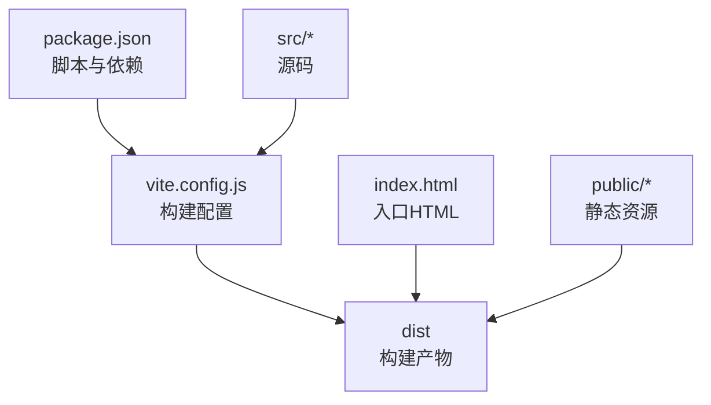
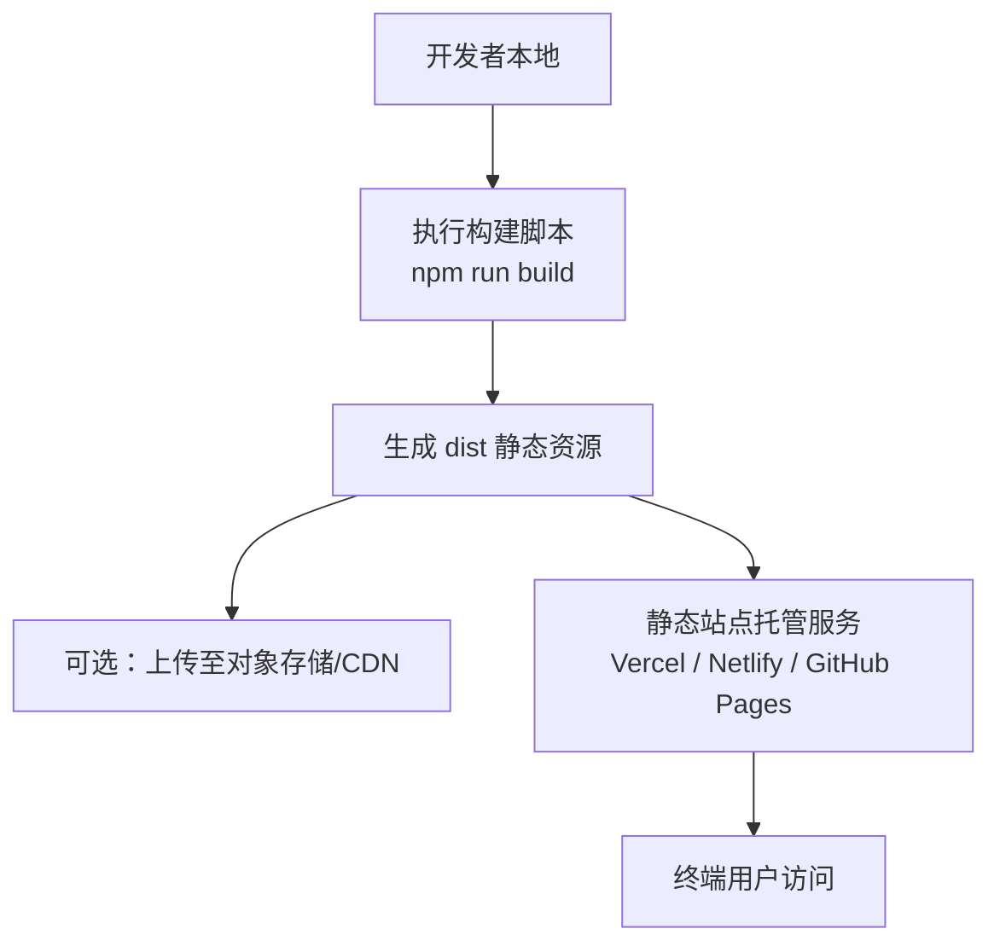
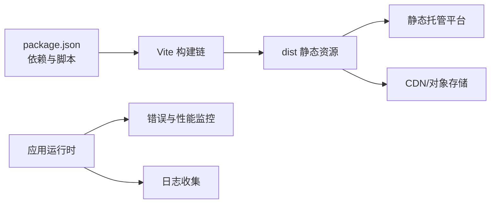

# 部署指南

<cite>
**本文引用的文件**   
- [package.json](file://package.json)
- [vite.config.js](file://vite.config.js)
- [index.html](file://index.html)
- [README.md](file://README.md)
</cite>

## 目录
1. [简介](#简介)
2. [项目结构](#项目结构)
3. [核心组件](#核心组件)
4. [架构总览](#架构总览)
5. [详细组件分析](#详细组件分析)
6. [依赖分析](#依赖分析)
7. [性能考虑](#性能考虑)
8. [故障排除指南](#故障排除指南)
9. [结论](#结论)
10. [附录](#附录)

## 简介
本指南面向运维与前端工程人员，提供 Goodent 项目的构建与生产部署全流程说明。内容覆盖 Vite 构建配置、生产环境优化、主流静态站点托管平台（Vercel、Netlify、GitHub Pages）的部署方法、环境变量与域名/SSL 配置、CDN 资源优化与缓存策略、CI/CD 自动化流水线搭建、监控与日志收集方案，以及常见问题的排查与回滚策略。

## 项目结构
Goodent 是基于 Vite + React 的前端项目，主要产物为静态资源。关键目录与文件：
- src：源码目录，包含页面、组件、样式与工具函数
- public：静态资源目录，用于存放无需打包的资源
- vite.config.js：Vite 构建配置
- package.json：脚本命令与依赖声明
- index.html：应用入口 HTML
- README.md：项目说明

图表来源
- [package.json](file://package.json)
- [vite.config.js](file://vite.config.js)
- [index.html](file://index.html)

章节来源
- [package.json](file://package.json)
- [vite.config.js](file://vite.config.js)
- [index.html](file://index.html)
- [README.md](file://README.md)

## 核心组件
- 构建系统：Vite，负责开发服务器、热更新与生产构建
- 包管理与脚本：通过 package.json 定义 build/dev 等脚本
- 入口与路由：index.html 作为 SPA 入口，配合前端路由实现单页应用
- 静态资源：public 目录下的资源在构建时直接复制到 dist

章节来源
- [package.json](file://package.json)
- [vite.config.js](file://vite.config.js)
- [index.html](file://index.html)

## 架构总览
下图展示从源码到生产产物的构建流程，以及典型静态托管平台的部署路径。

图表来源
- [package.json](file://package.json)
- [vite.config.js](file://vite.config.js)

## 详细组件分析

### Vite 构建配置与生产优化
本节聚焦 vite.config.js 的关键能力与可定制点，帮助在生产环境中获得更好的性能与稳定性。

- 基础构建选项
  - 输出目录：默认输出到 dist，便于直接部署到静态托管服务
  - 资源前缀：可通过 base 配置调整资源引用前缀，适配子路径或自定义域名
  - 目标浏览器：通过 target 指定目标环境，影响 Polyfill 与语法降级策略
  - 代码分割：启用动态导入与分包策略，减少首屏体积
  - 压缩与混淆：生产构建开启 JS/CSS 压缩与 Tree Shaking
  - 资源内联：对小体积资源进行内联以减少请求数
  - 插件生态：按需引入第三方插件以增强构建能力（如图片处理、字体优化等）

- 生产环境定制化建议
  - 使用多阶段构建或外部化大依赖，降低 bundle 体积
  - 合理设置 chunk 命名与哈希，提升缓存命中率
  - 对静态资源启用强缓存与协商缓存组合策略
  - 针对 3D 场景与大量媒体资源，采用分片加载与懒加载

章节来源
- [vite.config.js](file://vite.config.js)

### 环境变量与运行时配置
- 环境变量注入
  - 开发环境：通过 .env.development 或命令行参数注入
  - 生产环境：通过 .env.production 或平台提供的环境变量管理
  - 变量命名规范：遵循平台约定（如 VITE_ 前缀），避免泄露敏感信息
- 运行时读取
  - 在源码中通过标准方式读取环境变量，确保构建期替换
- 安全建议
  - 不在客户端暴露密钥；仅暴露公开 API 地址或开关
  - 使用平台的环境变量管理功能，避免将敏感信息提交到仓库

章节来源
- [package.json](file://package.json)
- [vite.config.js](file://vite.config.js)

### 静态站点托管平台部署

#### Vercel
- 前置条件
  - 代码仓库已推送至 Git 平台
  - 安装并登录 Vercel CLI（可选）
- 部署步骤
  - 在 Vercel 控制台创建新项目，选择当前仓库
  - 框架预设选择 Vite，构建命令与输出目录按默认即可
  - 配置环境变量（如 API 地址、功能开关）
  - 绑定自定义域名并启用自动 SSL
  - 触发部署并验证站点可用
- 高级配置
  - 使用 vercel.json 配置重定向、缓存头、边缘函数等
  - 利用 Preview Deployments 进行分支预览

章节来源
- [package.json](file://package.json)
- [vite.config.js](file://vite.config.js)

#### Netlify
- 前置条件
  - 代码仓库已推送至 Git 平台
- 部署步骤
  - 在 Netlify 控制台新建站点，选择当前仓库
  - 构建命令与发布目录按默认（通常为 dist）
  - 配置环境变量与全局重定向规则
  - 绑定自定义域名并启用 HTTPS
  - 触发部署并检查构建日志
- 高级配置
  - 使用 netlify.toml 配置构建、环境变量、Rewrite/Redirect、Headers
  - 使用 Functions 扩展服务端能力（如需）

章节来源
- [package.json](file://package.json)
- [vite.config.js](file://vite.config.js)

#### GitHub Pages
- 前置条件
  - 仓库已推送至 GitHub
- 部署步骤
  - 在仓库 Settings → Pages 中选择分支与目录（通常为 dist）
  - 若使用子路径部署，需在构建配置中设置 base 前缀
  - 触发 Actions 或使用 CI 脚本构建后推送 dist 到 gh-pages 分支
- 注意事项
  - 注意相对路径与绝对路径的差异
  - 自定义域名需添加 CNAME 记录并启用 HTTPS

章节来源
- [vite.config.js](file://vite.config.js)
- [index.html](file://index.html)

### 域名绑定与 SSL 证书
- 自定义域名
  - 在各平台控制台完成域名解析与绑定
  - 确认 DNS 生效后再进行访问测试
- SSL 证书
  - 推荐使用平台提供的自动签发与管理（Let's Encrypt）
  - 若使用自有证书，按平台指引上传并配置
- 强制 HTTPS
  - 在平台层面开启 HTTP→HTTPS 重定向
  - 在应用层确保所有资源链接使用 https 或协议相对路径

章节来源
- [vite.config.js](file://vite.config.js)

### CDN 资源优化与缓存策略
- 资源拆分与命名
  - 启用文件名哈希，利于长期缓存
  - 将第三方库拆分为独立 chunk，提高并行加载效率
- 缓存头配置
  - 静态资源：Cache-Control: public, max-age=31536000, immutable
  - HTML 与入口文件：Cache-Control: no-cache, must-revalidate
  - 根据平台能力设置响应头（如 Netlify Headers、Vercel Headers）
- 预取与预加载
  - 对关键资源使用 preload/prefetch 提示
  - 对首屏关键 CSS/JS 进行优先级提升
- 跨域与安全性
  - 正确配置 CORS 与 CSP
  - 避免在 URL 中携带敏感信息

章节来源
- [vite.config.js](file://vite.config.js)

### CI/CD 自动化流水线
- 通用流程
  - 拉取代码 → 安装依赖 → 构建 → 运行测试（可选）→ 部署
- GitHub Actions 示例要点
  - 使用 Node 环境矩阵匹配版本
  - 缓存 node_modules 加速构建
  - 构建产物缓存与增量构建
  - 部署到各平台（Vercel CLI、Netlify CLI、GitHub Pages）
- 分支策略与预览
  - main 分支触发生产部署
  - feature 分支触发预览部署
- 安全与凭据
  - 使用 Secrets 管理令牌与密钥
  - 最小权限原则

章节来源
- [package.json](file://package.json)

### 监控与日志收集
- 前端错误监控
  - 集成错误上报 SDK，捕获未处理异常与 Promise 拒绝
  - 上报上下文：URL、用户代理、时间戳、错误堆栈
- 性能监控
  - 采集 LCP、FID、CLS 等核心指标
  - 结合平台分析（如 Vercel Analytics、Netlify Analytics）
- 访问日志
  - 使用平台提供的访问日志与审计日志
  - 将关键事件同步到日志平台（如 ELK、Sentry）
- 告警与通知
  - 基于错误率与性能阈值设置告警
  - 通过邮件/IM 渠道通知运维团队

章节来源
- [package.json](file://package.json)

### 部署故障排除与回滚策略
- 常见问题定位
  - 构建失败：检查 Node 版本、依赖安装、环境变量
  - 资源 404：检查 base 前缀、路径大小写、静态资源路径
  - 跨域问题：检查后端 CORS 与前端请求头
  - 缓存导致不更新：清理浏览器缓存或增加版本号
- 快速回滚
  - 平台侧回滚：使用 Vercel/Netlify 的版本历史一键回滚
  - 分支回滚：切换至稳定分支并重新触发部署
  - 灰度发布：逐步放量新版本，观察指标后再全量
- 健康检查与蓝绿/金丝雀
  - 通过健康检查接口验证新实例可用性
  - 结合流量切分策略降低风险

章节来源
- [package.json](file://package.json)
- [vite.config.js](file://vite.config.js)

## 依赖分析
- 构建依赖
  - Vite 及其生态插件决定构建行为与产物形态
- 运行依赖
  - 运行时依赖应尽可能精简，减少包体与启动开销
- 外部服务
  - 静态托管平台、CDN、错误监控与日志平台

图表来源
- [package.json](file://package.json)
- [vite.config.js](file://vite.config.js)

章节来源
- [package.json](file://package.json)
- [vite.config.js](file://vite.config.js)

## 性能考虑
- 首屏优化
  - 关键路径资源内联与预加载
  - 路由级代码分割与懒加载
- 资源体积控制
  - 移除未使用代码（Tree Shaking）
  - 图片与字体按需加载与格式优化
- 缓存策略
  - 强缓存静态资源，协商缓存 HTML
  - 使用文件名哈希与版本化
- 网络优化
  - 启用 Gzip/Brotli 压缩
  - 合理使用 HTTP/2 与多路复用

[本节为通用指导，不涉及具体文件分析]

## 故障排除指南
- 构建阶段
  - 检查 Node 版本与包管理器一致性
  - 清理缓存后重试构建
- 部署阶段
  - 核对环境变量与平台 Secret
  - 查看平台构建日志定位错误
- 运行阶段
  - 打开浏览器开发者工具检查网络与 Console
  - 使用平台访问日志与错误监控定位问题

章节来源
- [package.json](file://package.json)
- [vite.config.js](file://vite.config.js)

## 结论
通过合理的 Vite 构建配置、完善的 CI/CD 流水线与科学的缓存策略，Goodent 可在主流静态托管平台上实现高效、稳定的生产部署。结合监控与日志体系，能够快速发现并解决问题，保障用户体验与服务可靠性。

[本节为总结性内容，不涉及具体文件分析]

## 附录
- 常用命令
  - 本地开发：npm run dev
  - 构建产物：npm run build
  - 预览构建结果：npm run preview
- 参考文档
  - Vite 官方文档
  - 各平台部署文档（Vercel、Netlify、GitHub Pages）

章节来源
- [package.json](file://package.json)
- [README.md](file://README.md)