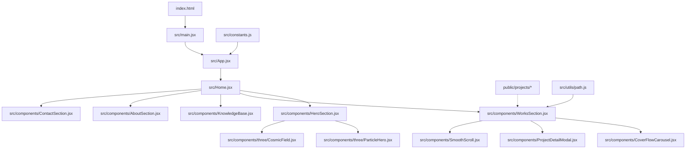
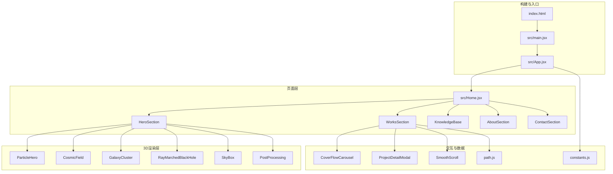
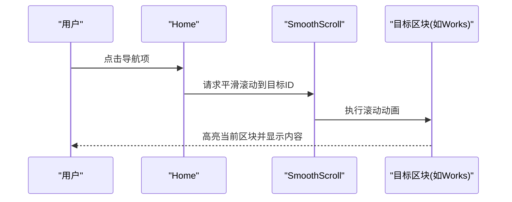
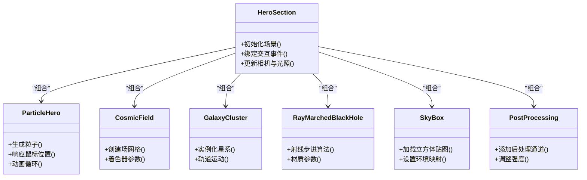
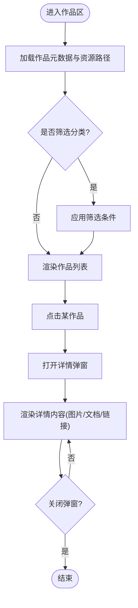
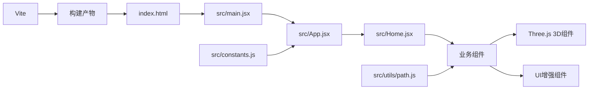

# 项目概述

<cite>
**本文引用的文件**   
- [package.json](file://package.json)
- [vite.config.js](file://vite.config.js)
- [index.html](file://index.html)
- [src/main.jsx](file://src/main.jsx)
- [src/App.jsx](file://src/App.jsx)
- [src/Home.jsx](file://src/Home.jsx)
- [src/constants.js](file://src/constants.js)
- [src/utils/path.js](file://src/utils/path.js)
- [src/components/HeroSection.jsx](file://src/components/HeroSection.jsx)
- [src/components/WorksSection.jsx](file://src/components/WorksSection.jsx)
- [src/components/KnowledgeBase.jsx](file://src/components/KnowledgeBase.jsx)
- [src/components/AboutSection.jsx](file://src/components/AboutSection.jsx)
- [src/components/ContactSection.jsx](file://src/components/ContactSection.jsx)
- [src/components/CoverFlowCarousel.jsx](file://src/components/CoverFlowCarousel.jsx)
- [src/components/ProjectDetailModal.jsx](file://src/components/ProjectDetailModal.jsx)
- [src/components/SmoothScroll.jsx](file://src/components/SmoothScroll.jsx)
- [src/components/three/ParticleHero.jsx](file://src/components/three/ParticleHero.jsx)
- [src/components/three/CosmicField.jsx](file://src/components/three/CosmicField.jsx)
- [src/components/three/GalaxyCluster.jsx](file://src/components/three/GalaxyCluster.jsx)
- [src/components/three/RayMarchedBlackHole.jsx](file://src/components/three/RayMarchedBlackHole.jsx)
- [src/components/three/SkyBox.jsx](file://src/components/three/SkyBox.jsx)
- [src/components/three/PostProcessing.jsx](file://src/components/three/PostProcessing.jsx)
- [src/components/ui/TiltCard.jsx](file://src/components/ui/TiltCard.jsx)
- [src/components/ui/CustomCursor.jsx](file://src/components/ui/CustomCursor.jsx)
</cite>

## 目录
1. [简介](#简介)
2. [项目结构](#项目结构)
3. [核心组件](#核心组件)
4. [架构总览](#架构总览)
5. [详细组件分析](#详细组件分析)
6. [依赖分析](#依赖分析)
7. [性能考虑](#性能考虑)
8. [故障排查指南](#故障排查指南)
9. [结论](#结论)
10. [附录](#附录)

## 简介
Goodent个人作品集是一个基于React + Vite构建的现代化个人作品集展示网站，强调沉浸式与可交互的视觉体验。项目通过Three.js实现3D粒子、星空背景、黑洞射线步进等高级渲染效果，结合响应式布局与流畅滚动，为访客提供“作品即场景”的浏览体验。

目标用户群体：
- 设计师、工程师、学生与创作者：用于集中展示课程作业、竞赛作品、实习实践与科研产出
- 招聘方与合作伙伴：快速了解作者能力边界与项目深度
- 同行与学习者：作为技术参考与灵感来源

使用场景：
- 在线简历与作品集门户
- 课程/实验室成果归档与分享
- 面试与路演前的可视化材料

技术特色：
- React生态（函数式组件、Hooks、路由）
- Three.js驱动的3D场景与后处理特效
- Vite极速构建与开发体验
- 模块化UI与可复用3D组件
- 响应式与无障碍友好的交互设计

## 项目结构
仓库采用按功能域划分的组织方式：
- public/projects：静态项目资源（图片、文档等），以年份或主题分目录存放
- src/components：页面级与业务组件，包含three子目录下的3D组件与ui子目录下的通用交互组件
- src/utils：工具函数（如路径解析）
- src：应用入口、根组件、常量与样式

图表来源
- [index.html:1-20](file://index.html#L1-L20)
- [src/main.jsx:1-40](file://src/main.jsx#L1-L40)
- [src/App.jsx:1-60](file://src/App.jsx#L1-L60)
- [src/Home.jsx:1-80](file://src/Home.jsx#L1-L80)
- [src/components/HeroSection.jsx:1-120](file://src/components/HeroSection.jsx#L1-L120)
- [src/components/WorksSection.jsx:1-120](file://src/components/WorksSection.jsx#L1-L120)
- [src/components/KnowledgeBase.jsx:1-120](file://src/components/KnowledgeBase.jsx#L1-L120)
- [src/components/AboutSection.jsx:1-120](file://src/components/AboutSection.jsx#L1-L120)
- [src/components/ContactSection.jsx:1-120](file://src/components/ContactSection.jsx#L1-L120)
- [src/components/three/ParticleHero.jsx:1-120](file://src/components/three/ParticleHero.jsx#L1-L120)
- [src/components/three/CosmicField.jsx:1-120](file://src/components/three/CosmicField.jsx#L1-L120)
- [src/components/CoverFlowCarousel.jsx:1-120](file://src/components/CoverFlowCarousel.jsx#L1-L120)
- [src/components/ProjectDetailModal.jsx:1-120](file://src/components/ProjectDetailModal.jsx#L1-L120)
- [src/components/SmoothScroll.jsx:1-120](file://src/components/SmoothScroll.jsx#L1-L120)
- [src/utils/path.js:1-60](file://src/utils/path.js#L1-L60)
- [src/constants.js:1-60](file://src/constants.js#L1-L60)

章节来源
- [package.json:1-60](file://package.json#L1-L60)
- [vite.config.js:1-60](file://vite.config.js#L1-L60)
- [index.html:1-20](file://index.html#L1-L20)
- [src/main.jsx:1-40](file://src/main.jsx#L1-L40)
- [src/App.jsx:1-60](file://src/App.jsx#L1-L60)
- [src/Home.jsx:1-80](file://src/Home.jsx#L1-L80)

## 核心组件
- 首页容器 Home：聚合各板块（封面、作品、知识库、关于、联系），负责整体布局与导航
- 封面 HeroSection：承载主视觉与3D粒子/星空背景，提供首屏沉浸感
- 作品 WorksSection：作品列表与分类，配合轮播与详情弹窗，支持平滑滚动定位
- 知识库 KnowledgeBase：知识沉淀与文章索引
- 关于 AboutSection：个人介绍与经历
- 联系 ContactSection：联系方式与表单入口
- 3D组件族：ParticleHero、CosmicField、GalaxyCluster、RayMarchedBlackHole、SkyBox、PostProcessing等，提供高性能渲染与后处理
- UI增强：TiltCard（倾斜卡片）、CustomCursor（自定义光标）、CoverFlowCarousel（封面流轮播）、SmoothScroll（平滑滚动）

章节来源
- [src/Home.jsx:1-80](file://src/Home.jsx#L1-L80)
- [src/components/HeroSection.jsx:1-120](file://src/components/HeroSection.jsx#L1-L120)
- [src/components/WorksSection.jsx:1-120](file://src/components/WorksSection.jsx#L1-L120)
- [src/components/KnowledgeBase.jsx:1-120](file://src/components/KnowledgeBase.jsx#L1-L120)
- [src/components/AboutSection.jsx:1-120](file://src/components/AboutSection.jsx#L1-L120)
- [src/components/ContactSection.jsx:1-120](file://src/components/ContactSection.jsx#L1-L120)
- [src/components/three/ParticleHero.jsx:1-120](file://src/components/three/ParticleHero.jsx#L1-L120)
- [src/components/three/CosmicField.jsx:1-120](file://src/components/three/CosmicField.jsx#L1-L120)
- [src/components/three/GalaxyCluster.jsx:1-120](file://src/components/three/GalaxyCluster.jsx#L1-L120)
- [src/components/three/RayMarchedBlackHole.jsx:1-120](file://src/components/three/RayMarchedBlackHole.jsx#L1-L120)
- [src/components/three/SkyBox.jsx:1-120](file://src/components/three/SkyBox.jsx#L1-L120)
- [src/components/three/PostProcessing.jsx:1-120](file://src/components/three/PostProcessing.jsx#L1-L120)
- [src/components/ui/TiltCard.jsx:1-120](file://src/components/ui/TiltCard.jsx#L1-L120)
- [src/components/ui/CustomCursor.jsx:1-120](file://src/components/ui/CustomCursor.jsx#L1-L120)
- [src/components/CoverFlowCarousel.jsx:1-120](file://src/components/CoverFlowCarousel.jsx#L1-L120)
- [src/components/ProjectDetailModal.jsx:1-120](file://src/components/ProjectDetailModal.jsx#L1-L120)
- [src/components/SmoothScroll.jsx:1-120](file://src/components/SmoothScroll.jsx#L1-L120)

## 架构总览
应用采用“单页+模块组件”的架构：Vite构建产物由index.html加载，main.jsx挂载React根节点，App.jsx定义全局状态与路由，Home.jsx组合页面区块，各区块内再引入3D与UI增强组件。

图表来源
- [index.html:1-20](file://index.html#L1-L20)
- [src/main.jsx:1-40](file://src/main.jsx#L1-L40)
- [src/App.jsx:1-60](file://src/App.jsx#L1-L60)
- [src/Home.jsx:1-80](file://src/Home.jsx#L1-L80)
- [src/components/HeroSection.jsx:1-120](file://src/components/HeroSection.jsx#L1-L120)
- [src/components/WorksSection.jsx:1-120](file://src/components/WorksSection.jsx#L1-L120)
- [src/components/KnowledgeBase.jsx:1-120](file://src/components/KnowledgeBase.jsx#L1-L120)
- [src/components/AboutSection.jsx:1-120](file://src/components/AboutSection.jsx#L1-L120)
- [src/components/ContactSection.jsx:1-120](file://src/components/ContactSection.jsx#L1-L120)
- [src/components/three/ParticleHero.jsx:1-120](file://src/components/three/ParticleHero.jsx#L1-L120)
- [src/components/three/CosmicField.jsx:1-120](file://src/components/three/CosmicField.jsx#L1-L120)
- [src/components/three/GalaxyCluster.jsx:1-120](file://src/components/three/GalaxyCluster.jsx#L1-L120)
- [src/components/three/RayMarchedBlackHole.jsx:1-120](file://src/components/three/RayMarchedBlackHole.jsx#L1-L120)
- [src/components/three/SkyBox.jsx:1-120](file://src/components/three/SkyBox.jsx#L1-L120)
- [src/components/three/PostProcessing.jsx:1-120](file://src/components/three/PostProcessing.jsx#L1-L120)
- [src/components/CoverFlowCarousel.jsx:1-120](file://src/components/CoverFlowCarousel.jsx#L1-L120)
- [src/components/ProjectDetailModal.jsx:1-120](file://src/components/ProjectDetailModal.jsx#L1-L120)
- [src/components/SmoothScroll.jsx:1-120](file://src/components/SmoothScroll.jsx#L1-L120)
- [src/utils/path.js:1-60](file://src/utils/path.js#L1-L60)
- [src/constants.js:1-60](file://src/constants.js#L1-L60)

## 详细组件分析

### 首页与页面编排（Home）
- 职责：统一布局、导航锚点、区块顺序与可见性控制
- 关键交互：点击导航平滑滚动至对应区块；在移动端折叠菜单与桌面端侧边栏切换
- 数据依赖：从常量与工具模块读取配置与路径

图表来源
- [src/Home.jsx:1-80](file://src/Home.jsx#L1-L80)
- [src/components/SmoothScroll.jsx:1-120](file://src/components/SmoothScroll.jsx#L1-L120)

章节来源
- [src/Home.jsx:1-80](file://src/Home.jsx#L1-L80)
- [src/components/SmoothScroll.jsx:1-120](file://src/components/SmoothScroll.jsx#L1-L120)

### 封面与3D场景（HeroSection + 3D组件）
- 职责：首屏主视觉、3D场景初始化、相机与光照管理、事件监听（鼠标/触摸）
- 3D组件协作：
  - ParticleHero：粒子系统，随鼠标移动产生动态扰动
  - CosmicField：宇宙场背景，营造深邃空间感
  - GalaxyCluster：星系集群，增加层次与景深
  - RayMarchedBlackHole：射线步进黑洞，提升视觉张力
  - SkyBox：天空盒，提供环境贴图
  - PostProcessing：后处理管线（泛光、景深等）
- 性能策略：按需加载、离屏渲染、纹理压缩、帧率自适应

图表来源
- [src/components/HeroSection.jsx:1-120](file://src/components/HeroSection.jsx#L1-L120)
- [src/components/three/ParticleHero.jsx:1-120](file://src/components/three/ParticleHero.jsx#L1-L120)
- [src/components/three/CosmicField.jsx:1-120](file://src/components/three/CosmicField.jsx#L1-L120)
- [src/components/three/GalaxyCluster.jsx:1-120](file://src/components/three/GalaxyCluster.jsx#L1-L120)
- [src/components/three/RayMarchedBlackHole.jsx:1-120](file://src/components/three/RayMarchedBlackHole.jsx#L1-L120)
- [src/components/three/SkyBox.jsx:1-120](file://src/components/three/SkyBox.jsx#L1-L120)
- [src/components/three/PostProcessing.jsx:1-120](file://src/components/three/PostProcessing.jsx#L1-L120)

章节来源
- [src/components/HeroSection.jsx:1-120](file://src/components/HeroSection.jsx#L1-L120)
- [src/components/three/ParticleHero.jsx:1-120](file://src/components/three/ParticleHero.jsx#L1-L120)
- [src/components/three/CosmicField.jsx:1-120](file://src/components/three/CosmicField.jsx#L1-L120)
- [src/components/three/GalaxyCluster.jsx:1-120](file://src/components/three/GalaxyCluster.jsx#L1-L120)
- [src/components/three/RayMarchedBlackHole.jsx:1-120](file://src/components/three/RayMarchedBlackHole.jsx#L1-L120)
- [src/components/three/SkyBox.jsx:1-120](file://src/components/three/SkyBox.jsx#L1-L120)
- [src/components/three/PostProcessing.jsx:1-120](file://src/components/three/PostProcessing.jsx#L1-L120)

### 作品展示与交互（WorksSection + Carousel + Modal）
- 职责：作品清单、分类筛选、封面流轮播、详情弹窗、平滑滚动定位
- 数据源：public/projects下按年份/主题组织的静态资源，通过工具路径解析访问
- 交互流程：选择作品 -> 打开详情弹窗 -> 展示图文/视频/链接 -> 关闭或跳转

图表来源
- [src/components/WorksSection.jsx:1-120](file://src/components/WorksSection.jsx#L1-L120)
- [src/components/CoverFlowCarousel.jsx:1-120](file://src/components/CoverFlowCarousel.jsx#L1-L120)
- [src/components/ProjectDetailModal.jsx:1-120](file://src/components/ProjectDetailModal.jsx#L1-L120)
- [src/utils/path.js:1-60](file://src/utils/path.js#L1-L60)

章节来源
- [src/components/WorksSection.jsx:1-120](file://src/components/WorksSection.jsx#L1-L120)
- [src/components/CoverFlowCarousel.jsx:1-120](file://src/components/CoverFlowCarousel.jsx#L1-L120)
- [src/components/ProjectDetailModal.jsx:1-120](file://src/components/ProjectDetailModal.jsx#L1-L120)
- [src/utils/path.js:1-60](file://src/utils/path.js#L1-L60)

### 知识库与内容管理（KnowledgeBase）
- 职责：知识条目索引、标签/分类、搜索与分页
- 扩展点：可接入Markdown/JSON数据源，便于持续维护

章节来源
- [src/components/KnowledgeBase.jsx:1-120](file://src/components/KnowledgeBase.jsx#L1-L120)

### 关于与联系（AboutSection + ContactSection）
- 职责：个人履历、技能栈、教育背景、联系方式与社交链接
- 最佳实践：将敏感信息置于环境变量或后端接口，前端仅暴露必要公开信息

章节来源
- [src/components/AboutSection.jsx:1-120](file://src/components/AboutSection.jsx#L1-L120)
- [src/components/ContactSection.jsx:1-120](file://src/components/ContactSection.jsx#L1-L120)

### 3D组件族详解
- ParticleHero：基于粒子系统的动态背景，适合首屏吸引注意力
- CosmicField：场类着色器，提供体积感与流动感
- GalaxyCluster：多实例星系，注意实例化数量与GPU开销
- RayMarchedBlackHole：复杂着色器，建议仅在高性能设备启用
- SkyBox：环境贴图，提升真实感
- PostProcessing：后处理通道，建议根据设备能力降级

章节来源
- [src/components/three/ParticleHero.jsx:1-120](file://src/components/three/ParticleHero.jsx#L1-L120)
- [src/components/three/CosmicField.jsx:1-120](file://src/components/three/CosmicField.jsx#L1-L120)
- [src/components/three/GalaxyCluster.jsx:1-120](file://src/components/three/GalaxyCluster.jsx#L1-L120)
- [src/components/three/RayMarchedBlackHole.jsx:1-120](file://src/components/three/RayMarchedBlackHole.jsx#L1-L120)
- [src/components/three/SkyBox.jsx:1-120](file://src/components/three/SkyBox.jsx#L1-L120)
- [src/components/three/PostProcessing.jsx:1-120](file://src/components/three/PostProcessing.jsx#L1-L120)

### UI增强组件
- TiltCard：鼠标悬停倾斜卡片，增强微交互
- CustomCursor：自定义光标，提升品牌一致性
- CoverFlowCarousel：封面流轮播，适配移动端手势

章节来源
- [src/components/ui/TiltCard.jsx:1-120](file://src/components/ui/TiltCard.jsx#L1-L120)
- [src/components/ui/CustomCursor.jsx:1-120](file://src/components/ui/CustomCursor.jsx#L1-L120)
- [src/components/CoverFlowCarousel.jsx:1-120](file://src/components/CoverFlowCarousel.jsx#L1-L120)

## 依赖分析
- 构建与运行：Vite作为构建工具，提供热重载与优化打包
- 运行时：React与ReactDOM，函数式组件与Hooks为主
- 3D渲染：Three.js及其生态（着色器、后处理、轨道控制器等）
- 工具库：路径解析、常量配置、动画与交互辅助

图表来源
- [package.json:1-60](file://package.json#L1-L60)
- [vite.config.js:1-60](file://vite.config.js#L1-L60)
- [index.html:1-20](file://index.html#L1-L20)
- [src/main.jsx:1-40](file://src/main.jsx#L1-L40)
- [src/App.jsx:1-60](file://src/App.jsx#L1-L60)
- [src/Home.jsx:1-80](file://src/Home.jsx#L1-L80)
- [src/constants.js:1-60](file://src/constants.js#L1-L60)
- [src/utils/path.js:1-60](file://src/utils/path.js#L1-L60)

章节来源
- [package.json:1-60](file://package.json#L1-L60)
- [vite.config.js:1-60](file://vite.config.js#L1-L60)

## 性能考虑
- 3D渲染
  - 限制粒子与实例数量，优先使用InstancedMesh
  - 对复杂着色器进行设备能力检测与降级
  - 使用纹理压缩与Mipmap，减少带宽与显存占用
- 资源加载
  - 懒加载非首屏资源与3D模型
  - 预加载关键纹理与字体
- 交互与动画
  - 节流/防抖鼠标与滚动事件
  - 使用requestAnimationFrame与时间步长稳定帧率
- 构建优化
  - 代码分割与按需导入
  - 静态资源CDN与缓存策略

[本节为通用指导，不直接分析具体文件]

## 故障排查指南
- 3D场景黑屏或崩溃
  - 检查WebGL上下文是否可用与浏览器兼容性
  - 确认纹理与模型路径正确且可访问
  - 降低后处理强度或禁用复杂着色器
- 资源404或加载失败
  - 核对public/projects目录结构与路径解析逻辑
  - 检查构建输出与部署路径前缀
- 交互卡顿
  - 减少同时运行的3D场景数量
  - 检查事件监听器是否重复绑定或未清理
- 移动端异常
  - 验证触摸事件与视口缩放设置
  - 降低分辨率与粒子密度

章节来源
- [src/utils/path.js:1-60](file://src/utils/path.js#L1-L60)
- [src/components/three/PostProcessing.jsx:1-120](file://src/components/three/PostProcessing.jsx#L1-L120)
- [src/components/three/RayMarchedBlackHole.jsx:1-120](file://src/components/three/RayMarchedBlackHole.jsx#L1-L120)

## 结论
Goodent个人作品集以现代前端技术栈为基础，将3D可视化与交互式UI深度融合，形成兼具美观与实用的展示平台。通过模块化组件与清晰的架构分层，项目在可扩展性与可维护性上具备良好基础。建议在后续迭代中持续优化资源加载与渲染性能，完善无障碍与国际化支持，并建立内容生产流水线以提升维护效率。

[本节为总结性内容，不直接分析具体文件]

## 附录
- 快速开始
  - 安装依赖并启动开发服务器
  - 构建生产版本并部署至静态托管服务
- 最佳实践
  - 将3D场景拆分为独立组件并按需加载
  - 使用常量与配置文件统一管理站点元数据
  - 为所有交互元素提供键盘与屏幕阅读器支持

[本节为补充说明，不直接分析具体文件]