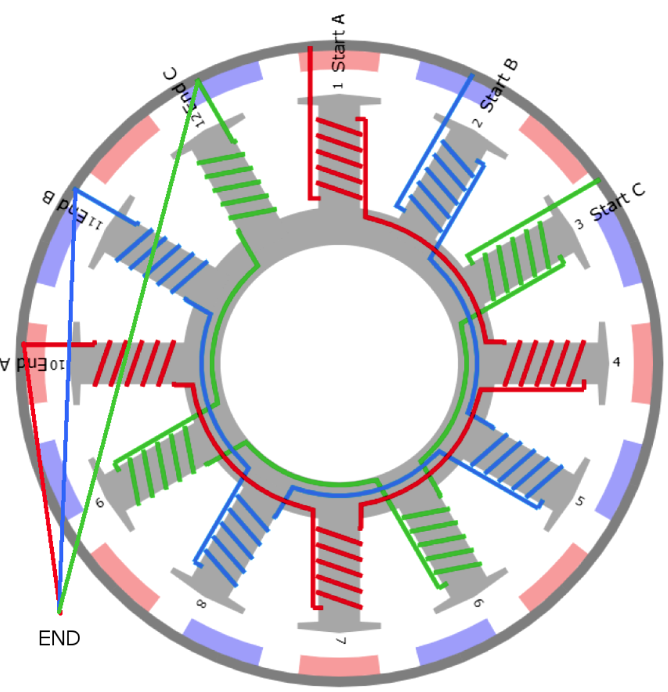

# DIY 无刷直流电机（BLDC）

基于 3D 打印结构的自制三相无刷直流电机：**12 槽 16 极、空芯定子、星形接法**，由无感航模电调 + ESP32-S3 驱动。项目完整复刻自开源 DIY 方案，并完成了从建模、打印、绕线到电控联调的全过程。

> ⚡ 运行实录见 [`videos/运行视频.mp4`](videos/运行视频.mp4)

---

## 参数速览

| 项目 | 规格 |
|---|---|
| 极槽配合 | 12 槽 16 极（q = 0.5 分数槽） |
| 定子 | 3D 打印塑料骨架，空芯线圈（无铁芯） |
| 绕组 | 全齿集中绕，每齿 17 匝，三相星形（Y）连接 |
| 转子 | 16 块钕铁硼磁铁 N/S 交替表贴 |
| 轴承 | MR95ZZ |
| 电调 | 好盈乐天 Skywalker 40A（2–6S，无 BEC） |
| 主控 | Seeed XIAO ESP32-S3（50 Hz PWM 油门信号） |
| 电源 | 2S 锂电 7.4 V（XT60） |
| 估算 KV | 1500–3000 rpm/V（待电钻法实测标定） |

---

## 目录结构

```
.
├── README.md                      # 本文档
├── models/                        # 3D 打印模型（STL）
│   ├── Stator-Body.stl            # 定子骨架（12 齿，绕线载体）
│   ├── Stator Base-Body.stl       # 定子底座（含轴承座）
│   ├── Rotor-Body.stl             # 转子杯（内壁贴 16 块磁铁）
│   └── Base Ring-Body.stl         # 基础环 / 端盖
├── images/                        # 图片资料
│   ├── 绕线方式.PNG               # 12 槽三相星接示意图（见下文）
│   ├── 磁铁物料-1.JPEG            # 钕铁硼磁铁备料
│   └── 磁铁物料-2.JPEG
├── videos/
│   └── 运行视频.mp4               # 电机运行实录
└── docs/
    └── 电机设计-工程应用指南.md   # 深度技术文档（电磁原理→绕组设计→选型）
```

---

## 设计与制作

### 结构方案

- **定子**：打印件为塑料（非导磁），线圈等效空芯，磁路全部走空气——结构简单、无齿槽转矩，但转矩弱、无感电调难以自启动（需拨动助转，后续升级方向是加装硅钢片铁芯）。
- **转子**：杯形打印件内壁均匀粘贴 16 块钕铁硼磁铁，N/S 极交替排列，构成 8 对极磁场。
- **装配**：定子底座安装 MR95ZZ 轴承，转子杯套在定子外，气隙约 1–2 mm。

### 绕线方式（核心）



**相序分配：`A B C A B C A B C A B C`**（齿 1 → 齿 12 顺序），星点由三相尾端（10A / 11B / 12C）并接而成：

| 齿号 | 1 | 2 | 3 | 4 | 5 | 6 | 7 | 8 | 9 | 10 | 11 | 12 |
|---|---|---|---|---|---|---|---|---|---|---|---|---|
| 相 | A | B | C | A | B | C | A | B | C | A | B | C |

**原理**：转子 16 极（8 对极），相邻齿机械角 30°，对应电角度 30° × 8 = 240°。逐齿取模 360° 后，齿 1/4/7/10 电角度同为 0°（相差 720° 整周期），故同属 A 相；B、C 相类推。同相 4 齿电动势同相位，必须**同方向绕制、首尾串联**才能叠加。

> ⚠️ 关键约束：12 个齿必须**全部同向绕**（如从上方看均为顺时针）。若相邻齿交替反向绕，同相线圈会互相抵消（+ − + −），电机只会抖动不转。验证方法：给单相短暂通 1.5 V 直流，用指南针检查同相 4 齿极性是否一致。

---

## 接线

```
2S电池 XT60 ──────────► 电调电源输入（红=+，黑=-，严禁反接）
                            │
电调三根粗输出线 ─────────► 电机 U/V/W（三相线，顺序随意，反转则对调两根）

电调信号插头（3线）：
   信号线 ──► XIAO ESP32-S3 D0 (GPIO1)
   GND ─────► XIAO GND（必须共地）
   红线 ──── 悬空（电调无 BEC，此线无电）

XIAO 供电 ── USB（严禁将 2S 接至 XIAO 背面电池焊盘，仅支持单节锂电）
```

---

## 控制代码（XIAO ESP32-S3）

依赖：Arduino IDE + ESP32 开发板包（选 `XIAO_ESP32S3`）+ `ESP32Servo` 库。

```cpp
#include <ESP32Servo.h>

Servo esc;
const int ESC_PIN = 1;   // XIAO D0

void setup() {
  Serial.begin(115200);
  ESP32PWM::allocateTimer(0);
  esc.setPeriodHertz(50);                 // 标准航模 50Hz 信号
  esc.attach(ESC_PIN, 1000, 2000);        // 1000µs=停，2000µs=满油门

  esc.writeMicroseconds(1000);            // 上电先给零油门，触发电调自检
  delay(3000);

  for (int us = 1000; us <= 1150; us += 50) {   // 缓慢爬坡至起转区
    esc.writeMicroseconds(us);
    Serial.printf("油门: %d us\n", us);
    delay(2000);
  }
}

void loop() {}
```

**油门参数**：`1000 µs` 停转 → `1050–1150 µs` 起转区（空芯定子需拨动助转）→ `2000 µs` 满转。

---

## 上电调试流程

1. 零油门（1000 µs）状态下插电池，电调奏上行音阶 + 2 声短鸣（识别 2S）；
2. 缓慢加油门至 1100 µs 附近，电机"咔咔"抖动属正常（无齿槽转矩），用塑料棒拨动转子助转；
3. 转向不对 / 启动不顺 → 对调任意两根相线；
4. 连续运转 2 分钟后检查线圈与电调温升，烫手立即停机。

### KV 实测标定（电钻法）

电钻拖动电机至约 1000 rpm，万用表交流档测任意两相间电压 V_LL：

```
KV ≈ n (rpm) ÷ V_LL (V)
匝数换算：N_新 = N_旧 × KV_旧 ÷ KV_目标
```

---

## 硬件清单

| 类别 | 型号 / 规格 | 备注 |
|---|---|---|
| 电调 | 好盈乐天 Skywalker 40A | 2–6S，无 BEC，信号 1000–2000 µs |
| 主控 | Seeed XIAO ESP32-S3 | D0 输出 PWM，USB 供电 |
| 电源 | 2S 锂电 7.4 V（XT60） | 首测电压；6S 22.2 V 备用（铁芯改造前禁用） |
| 漆包线 | 0.3–0.5 mm | 每齿 17 匝（骨架窗口上限） |
| 磁铁 | 钕铁硼 × 16 | N/S 交替表贴 |
| 轴承 | MR95ZZ | 5 mm 级深沟球 |
| 工具 | 万用表、电钻、指南针 | 测电阻 / 测 KV / 极性校验 |

---

## 性能优化路线图

| 优先级 | 方向 | 做法 | 收益 |
|---|---|---|---|
| 1 | **定子加铁芯** | 齿部插叠硅钢片冲片或软铁极靴 | 气隙磁密提升 3–5 倍，扭矩同比例提升；产生齿槽转矩，解决无法自启动 |
| 2 | 强化磁路 | N52 磁铁、加厚磁钢、气隙压至 0.5–1 mm | 扭矩与效率显著提升 |
| 3 | 绕组优化 | 多股细线并绕提高槽满率；星形改三角形（KV × √3） | 降铜损 / 提转速 |
| 4 | 驱动升级 | 编程卡调高进角；换 FOC 正弦波电调 | 启动成功率、效率、静音 |
| 5 | 电压提升 | 铁芯完成后逐步上 3S / 4S | 转速线性提升 |
| 6 | 机械可靠性 | 磁铁加碳纤维环箍、转子动平衡 | 高转速安全前提 |
| 7 | 闭环控制 | 霍尔 / 编码器 + ESP32 有感 FOC | 低速扭矩与精准调速（可衔接机器人应用） |

---

## 深度技术文档

完整的电磁原理与设计方法论见 [docs/电机设计-工程应用指南.md](docs/电机设计-工程应用指南.md)：

- 第 1–2 章：麦克斯韦方程组、法拉第定律、磁路与永磁材料
- 第 3 章：绕组设计——匝数 N、线径、槽满率与铜损
- 第 4 章：BLDC 原理——极槽配合、六步换向、KV 值
- 第 6–7 章：参数选型估算与边界条件敏感性分析

## 致谢与参考

- 灵感与结构参考：YouTube《How To Make A Brushless DC Motor》（B 站搬运：BV1NK716mEuN）
- 电调编程参考：好盈 Skywalker 系列说明书

## 安全提示

高速旋转件存在解体风险：测试务必戴护目镜、转子磁铁外加箍带、首测不装桨、禁止堵转实验。
